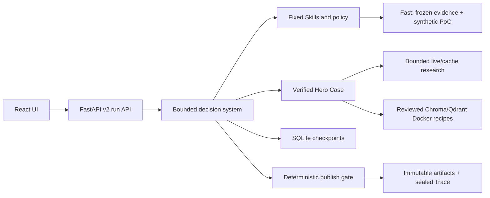

# MOMO TechScout

[](https://github.com/bluefateludi/MOMO-TechScout/actions/workflows/ci.yml)
[](https://www.python.org/)
[](https://nodejs.org/)
[](LICENSE)

MOMO TechScout is an evidence-grounded research and verification agent for Python AI developers choosing open-source components. Give it a project environment, hard constraints, and candidate components; it returns a traceable recommendation, an explicit `no_safe_winner`, or an honest limited/failed result.

The v0.1.0 scope is deliberately narrow: local-RAG Python vector stores. Chroma and Qdrant Local have reviewed compatibility recipes. pgvector and unknown candidates remain research-only. A recipe checks a small contract; it is not production performance, security, operations, or cost certification.

## Choose the right mode

| Path | Authority | What a successful result means |
|---|---|---|
| Fast Demo (`mode=fast`) | Frozen synthetic evidence and deterministic synthetic PoC responses through the real bounded Harness, Skills, local stdio MCP, checkpoints, gate, artifacts, and sealed Trace | The synthetic vertical slice passed. It is not live research or Docker verification. |
| Verified (`mode=verified`) | Bounded live/cache research and reviewed Docker recipes for the fixed Python 3.11 Chroma/Qdrant Local Hero Case | The available non-synthetic evidence and required PoCs passed. Provider/cache, Docker, and an externally enforced install network are still required. |
| Offline fixture | Bundled immutable or simulated UI/API data | Screens and contracts can be reviewed. It is not research output or execution proof. |

Missing provider/cache or Docker capacity never borrows Fast fixtures: Verified ends as limited, `no_safe_winner`, or failed. pgvector and unknown candidates cannot cross the PoC recommendation boundary.

## Five-minute Fast Demo

With the supported tools already installed and normal package-registry access, the first Fast Demo should be ready in about five minutes. Dependency installation uses PyPI and npm; the demo itself makes no provider, research-network, or Docker call.

| Tool | Supported baseline |
|---|---|
| Python | 3.10 or newer; CI and the Web container use 3.12 |
| Node.js/npm | Node 20 LTS; dependencies are locked by `web/package-lock.json` |
| Docker | Optional for Fast Demo. Docker Engine with BuildKit and Compose v2 is the supported interface; no engine minor-version matrix is claimed. |

From the repository root:

```console
python -m pip install -e .
cd web
npm ci --ignore-scripts
npm run build
cd ..
techscout serve
```

Open `http://127.0.0.1:8000`, keep **Fast Demo** selected, enter a decision question (for example, “Which local vector store fits this service?”), and start the task. Confirm that the terminal result keeps its synthetic label visible and shows a report, evidence, PoC records, and Trace. A `completed` Fast result proves only the frozen fixture path.

The server binds to loopback because it has no authentication. `python -m paper_agent.web` remains a compatibility entry point; `paper-agent` and `paper_agent` remain the historical Scholar command/import names and are not TechScout evaluation authority.

### Docker Compose alternative

```console
docker compose up --build
```

Compose publishes only `127.0.0.1:8000`, uses a named volume for run data, and does not mount the Docker socket. It starts the same synthetic Fast path. A Verified request in this container normally reports Docker unavailable unless an operator supplies a separate secured runner boundary.

## Verified prerequisites

Verified is implemented only for the bounded Hero Case. Configure `TAVILY_API_KEY` for live search, optionally `GITHUB_TOKEN` for higher read-only GitHub limits, a reachable Docker daemon, `TECHSCOUT_DOCKER_INSTALL_NETWORK`, and `TECHSCOUT_DOCKER_EGRESS_ALLOWLIST_ENFORCED=true` in `.env` or the environment.

The install network must be enforced outside TechScout and restricted to the approved package hosts. The repository does not create or certify that boundary. Runtime tests are networkless, secrets are not forwarded to the sandbox, and absent infrastructure becomes a typed limitation instead of a compatibility claim. See the [operator guide](docs/techscout/running.md) and [security boundary](docs/techscout/support-and-safety.md).

## Architecture



Code—not model prose—owns state transitions, budgets, tool permissions, recipe compilation, recovery bounds, terminal status, and publishability.

## Troubleshooting

| Symptom | Check |
|---|---|
| `techscout` is not found | Activate the environment where `pip install -e .` ran, or use `python -m paper_agent.techscout.cli serve`. |
| `/` returns 404 or no UI appears | Run `npm ci --ignore-scripts && npm run build` in `web/`; the server expects `web/dist/index.html`. |
| Port 8000 is busy | Start with `techscout serve --port 8001` and open the matching loopback URL. |
| Verified ends limited or `no_safe_winner` | Check the visible provenance and limitations, then verify provider/cache, Docker daemon, and enforced install-network settings. This is expected fail-closed behavior. |
| Verified under Compose reports Docker unavailable | The Web container intentionally has no Docker socket. Use Fast there or provide a separately secured runner boundary. |
| A candidate is `research_only` | Only Chroma and Qdrant Local have reviewed v0.1.0 recipes; missing infrastructure is not proof of incompatibility. |

Do not delete `outputs/` or run `docker compose down --volumes` unless you intend to remove local run history.

## Evidence and release claims

The recorded headed-browser acceptance covers the frozen synthetic Fast Hero Demo: three consecutive runs terminalized inside its 120-second budget. It does not authorize live-model quality, retrieval, recovery-rate, token, latency, cost, or component-performance claims. The sealed synthetic evaluation runner is infrastructure evidence only; product-effect and resume metrics remain **N/A**. Full provenance is in the [final delivery authority](docs/techscout/final-delivery.md).

No screenshot or GIF is committed as v0.1.0 authority. Until a stable capture is reproducible, demos should use the running Fast UI with its synthetic label visible and record the source commit; never substitute a mock or fabricated run image.

## Documentation and community

- [TechScout documentation map](docs/techscout/README.md)
- [Architecture and artifact authority](docs/techscout/architecture.md)
- [Run modes and operator guide](docs/techscout/running.md)
- [V1 support matrix and security boundary](docs/techscout/support-and-safety.md)
- [Contributing](CONTRIBUTING.md)
- [Security policy](SECURITY.md)

MOMO TechScout is licensed under [AGPL-3.0](LICENSE). Third-party notices are recorded in [THIRD_PARTY_NOTICES.md](THIRD_PARTY_NOTICES.md).
