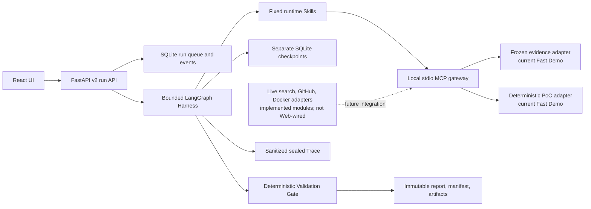

# MOMO TechScout

MOMO TechScout is an evidence-grounded research and verification agent for Python AI developers choosing open-source components. A task supplies the project environment, hard constraints, and candidate components; TechScout runs a bounded, checkpointed investigation and returns either a traceable recommendation, an explicit `no_safe_winner`, or a limited/failed result.

The current V1 family is deliberately narrow: local-RAG Python vector stores. Chroma and Qdrant Local have reviewed PoC recipes. pgvector and unknown candidates remain research-only unless a later decision adds a trusted fixture. The PoCs check small compatibility contracts; they do not certify production performance.

**Hero Demo 已验收：** 在 `origin/master@7c6a9ed25b50f790d3a0b39a541e46258da71f5a` 的 Chromium 验收中，连续三次 Fast Demo 均在 120 秒预算内终态化，浏览器 wall-clock 分别为 **45.081 s、15.360 s、12.879 s**。这是冻结 synthetic Fast Demo 的产品验收，不是 Live 模型质量或组件性能基准。

> Documentation status: this is the PR #92 authority draft. Final sealing is deferred until #93 is merged and the branch is normally merged with the resulting latest `master`.

## What works today

| Surface | Current status | Honest interpretation |
|---|---|---|
| Fast Demo (`mode=fast`) | Implemented | Runs the real bounded LangGraph Harness, fixed Skill router, local stdio MCP transport, checkpoints, deterministic gate, artifacts, and sealed Trace over frozen synthetic evidence and deterministic synthetic PoC responses. It makes no live provider, research-network, or Docker call. |
| Verified request (`mode=verified`) | Explicitly limited | The API accepts the request, but the current Web executor returns `completed_with_limitations` with `live_execution_unavailable`; it is not a successful Live verification run. |
| Offline fixture | Implemented | Immutable/simulated UI and API fixture for reviewing screens and contracts. It is not research output, a benchmark, or proof of Docker execution. |
| Live execution | Future integration | Bounded Tavily, HTTPS fetch, read-only GitHub, cache, and Docker sandbox modules exist, but they are not connected to the default Web run path at this authority. |
| Evaluation | Infrastructure accepted, product-effect claims unavailable | The fixed runner, metrics, partial-result preservation, and sealing were exercised only with synthetic fixtures. Task Success, Recall, token/cost, and recovery diagnostics from that run are not resume or product-effect evidence. |

## Quick start: current Fast Demo

Prerequisites: Python 3.10+, Node.js/npm, and a local checkout. No provider key or Docker daemon is required for this path.

```console
python -m pip install -e .
cd web
npm ci
npm run build
cd ..
python -m paper_agent.web
```

Open `http://127.0.0.1:8000`, submit a Fast Demo task, or open the synthetic offline fixture. Keep its synthetic labeling visible when presenting it. The server binds to loopback by default because the local product has no authentication.

The package and CLI names still retain the historical `paper_agent` / `paper-agent` compatibility surface. The legacy paper workflow remains attributable to MOMO Scholar and is not presented as a TechScout evaluation baseline.

## Architecture



The deterministic gate—not model prose—controls publishability. Unknown recipes cannot cross the PoC boundary, unsupported critical recommendations are rejected, and recovery may repeat only the failed stage within the policy bound.

## Result semantics

- `completed`: the active execution boundary passed its required gates. For the current synthetic Fast Demo, this is fixture acceptance only—not a live component claim.
- `completed_with_limitations`: a useful report exists but evidence, provider, Docker, or verification coverage is incomplete.
- `failed`: no safe schema-valid report could be published.
- `no_safe_winner`: evidence or trusted verification did not cover the hard constraints; TechScout refuses to fabricate a recommendation.

## Documentation

- [Delivery status and documentation map](docs/techscout/README.md)
- [Architecture and artifact authority](docs/techscout/architecture.md)
- [Run modes and operator guide](docs/techscout/running.md)
- [V1 support matrix and security boundary](docs/techscout/support-and-safety.md)
- [Final evaluation and browser acceptance authority](docs/techscout/final-delivery.md)
- [Interview story and four STAR resume drafts](docs/techscout/interview-and-resume.md)
- [Product-scope ADR](docs/decisions/0001-techscout-product-scope-and-support.md)

MOMO TechScout is licensed under AGPL-3.0; see `LICENSE` and `THIRD_PARTY_NOTICES.md`.
