# MOMO Scholar final delivery record

This is the stable closeout record for claims that are already authoritative and
for the two deliberately unfinished evaluation authorities. The Web demo is not a
quality benchmark.

## Source-to-report architecture

```mermaid
flowchart LR
    Q["Question + frozen run settings"] --> S["arXiv search and acquisition"]
    S --> D["PDF text or explicit abstract fallback"]
    D --> C["Section-aware chunks"]
    C --> R["Keyword / Vector / Hybrid retrieval"]
    R --> A["Per-paper checked analysis"]
    A --> Y["Survey synthesis"]
    Y --> V["Citation validation and publishability check"]
    V --> P["Immutable run artifacts\nreport + Evidence + manifest + logs"]
    P --> API["FastAPI projections and allowlisted downloads"]
    API --> UI["React report, paper analysis, and Evidence views"]
```



The filesystem artifacts and terminal manifest remain research authority. SQLite
stores discovery and queue projections only; the Web layer never rewrites research
output to match registry state.

## Verified facts and authorities

| Area | Verified result | Source authority / hash |
|---|---|---|
| Retrieval 40 | Hybrid Recall@8 `1.0`; Vector `1.0`; Keyword `.95`; Hybrid-Keyword `+.05`, bootstrap 95% CI `[0, .125]`; `0/40` failures | Sealed Retrieval 40 evidence-package verifier authority merged in PR #61 at Git commit `ae70b48ccad6cbcd8221d719d29bb68abc764a72`. The generated package is local-only; this document does not invent a package digest absent from the clean checkout. |
| Citation generation | `20/20` successful cases; `20` sends; `0` retries; `19,472` total tokens; estimated CNY `0.054478` | Frozen generation authority documented in `docs/citation-automated-judge.md`; aggregate `pipeline-outputs.jsonl` SHA-256 `05ad82a7ad2dcb27900bb82877f07f09ed556a1092128cbeab7744f3275a0541`; package-manifest SHA-256 `72683899d8db7eadd57c29e462b5c32e3e9e9bc1690361803038ca6df9a8a21d`. |
| Stage 4 offline demo | **PASS**: focused backend/frontend tests, contract projection, production build, same-origin synthetic create/progress/terminal/report/paper/Evidence/download flow, desktop and narrow smoke | Tested from `origin/master` Git commit `c0b1beed41c7759dea168766783bc39237a76646`; commands and current counts are in the acceptance record below. |

The Citation generation cost is a historical measured estimate, not authorization
for another provider call. Retrieval and Citation authorities are independent;
neither allows the Web demo to claim benchmark quality.

## Stage 4 acceptance record

| Check | Result |
|---|---|
| `python -m pytest tests/web -q` | PASS — 17 passed |
| `npm test` | PASS — 18 passed |
| `npm run contracts:check` | PASS — OpenAPI/TypeScript projection matched |
| `npm run build` | PASS — TypeScript and Vite production build completed |
| Desktop Chromium smoke, 1440 px | PASS — same-origin fake run and content path; zero console errors; `scrollWidth == clientWidth == 1440` |
| Narrow Chromium smoke, 390 px | PASS — Evidence view; `scrollWidth == clientWidth == 390` |
| Artifact downloads | PASS — eight links visible in browser; backend contract test validates every allowlisted attachment and content type |

All checks were offline. The explicit `SyntheticBrowserRunner` used in browser
acceptance persisted `operations=0` and `http_attempts=0`. No real provider call,
credential, benchmark, Citation judge, or paid action was used.

## Engineering tradeoffs

- **Provider timeout, resume, and budget ledger.** Network operations have bounded
  timeouts and sanitized failures. Resumable evaluation treats completed work as
  immutable and budgets reserved/unknown sends conservatively, preventing a retry
  from silently buying the same operation twice. This favors auditability over
  aggressive automatic recovery.
- **Immutable Evidence packages.** Outputs bind normalized inputs, configuration,
  source identities, hashes, operation records, and projections. Recompute and
  verification read the sealed authority instead of mutating it. Storage is less
  convenient than a mutable working directory, but provenance survives review and
  resume.
- **Single-pass LLM-as-Judge.** The pending Citation semantic score uses one
  Gold-grounded, blinded judge pass for unresolved assertions. It is reproducible
  and budgetable, but has no second independent judge, inter-rater reliability, or
  adjudication; model bias and semantic errors remain explicit limitations.

## Pending final authorities — single fill-in site

| Final item | Current value |
|---|---|
| Citation Coverage, Citation Validity, Unsupported Assertion Rate, denominators, confidence intervals, method, and sealed package hashes | `PENDING_CITATION_AUTHORITY` |
| Final combined 60-case manifest path/hash and compatibility verification | `PENDING_FINAL_60_MANIFEST` |

These placeholders mean the results do not exist yet. They must not be replaced
with generation success, Retrieval metrics, demo observations, or estimates.

The last task performs a tiny docs-only fill:

1. Verify the sealed Citation package and final 60-case manifest offline.
2. Replace the two table values above with exact metrics, method label, authority
   paths, and SHA-256 hashes. Do not edit the surrounding architecture, demo,
   acceptance, or tradeoff sections.
3. Confirm no placeholder remains:

```powershell
rg -n "PENDING_CITATION_AUTHORITY|PENDING_FINAL_60_MANIFEST" README.md docs
```

## One pending bounded live Web E2E

This is intentionally **not run** during offline closeout. After both placeholders
are filled, obtain explicit authorization for one provider-backed run, including:

- a valid `DASHSCOPE_API_KEY` supplied outside source control;
- outbound network access;
- the exact dated provider/model authority and current price authority;
- approval for one paper, one run, and its maximum sends/tokens/cost; and
- confirmation that no evaluation, Retrieval benchmark, or Citation judge command
  will run.

Start the bounded local server with a dedicated state/output root:

```powershell
python -m paper_agent.web --host 127.0.0.1 --port 8000 --state-root outputs/.web-live-e2e --output-root outputs/web-live-e2e
```

Then create exactly one `paper_limit=1`, `pdf_preferred`, `auto` run in the UI;
observe queued/running and its honest terminal state; open the report (when
published), paper analysis, and Evidence; download all eight allowlisted artifacts;
and confirm no secret, raw provider body, or absolute path appears. Stop after that
single run. This is the only remaining live Web E2E action and it remains subject
to the explicit provider/cost authorization above.
