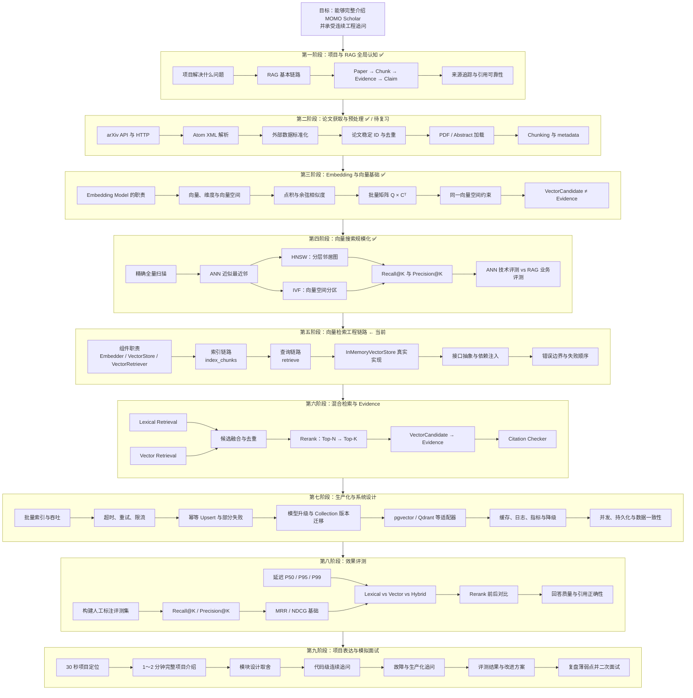

# MOMO Scholar 面试导向学习全图

## 学习目标

这条路线的目标不是学习所有 AI 理论，而是能够：

1. 清楚说明 MOMO Scholar 解决的问题和完整数据流；
2. 结合真实代码解释模块职责、接口边界和设计取舍；
3. 回答异常处理、扩展性、生产化和效果评测问题；
4. 完成 30 秒、1～2 分钟和深度版本的项目表达；
5. 承受从项目概述到代码细节的连续面试追问。

## 完整学习地图



## 当前坐标

当前位于第五阶段：

```text
向量检索工程链路
→ 组件职责已经初步学习
→ 下一步学习 VectorRetriever.index_chunks()
```

整体粗略进度约为 `35%～40%`：

| 阶段 | 当前状态 |
|---|---|
| 项目与 RAG 全局认知 | 已学习 |
| 论文获取与预处理 | 已有基础，后续复习 |
| Embedding 与向量基础 | 已学习 |
| ANN 与检索评测基础 | 已学习 |
| 向量检索工程链路 | 正在学习 |
| 混合检索与 Evidence | 待系统学习 |
| 生产化与系统设计 | 待学习 |
| 效果评测 | 待学习 |
| 项目表达与模拟面试 | 最终训练 |

## 第一阶段：项目与 RAG 全局认知

### 学习内容

- MOMO Scholar 解决的问题；
- 基础 RAG 数据流；
- `Paper`、`Chunk`、`Evidence` 和 `Claim` 的区别；
- 为什么生成结论必须保留来源追踪；
- 向量相似为什么不等于证据支持。

### 掌握标准

能够不看代码说明：

```text
Research Question
→ Paper Retrieval
→ Load / Chunk
→ Candidate Retrieval
→ Evidence
→ Claim
→ Citation Validation
→ Report
```

## 第二阶段：论文获取与预处理

### 学习内容

- arXiv API、HTTP 请求、状态码和超时；
- Atom XML 与命名空间；
- 第三方字段向统一 `Paper` 模型的标准化；
- arXiv ID、DOI、标题等稳定身份与去重；
- PDF 加载失败时的 Abstract 降级；
- Chunk 大小、重叠、section/page 和稳定 `chunk_id`。

### 主要面试追问

- 为什么分离 HTTP 请求与 XML 解析？
- 标题去重有哪些误判和漏判？
- 如何处理多数据源中的同一篇论文？
- Chunk 太大或太小分别有什么问题？

## 第三阶段：Embedding 与向量基础

### 学习内容

- Embedding Model 与 Vector Store 的职责；
- 固定维度与分布式语义表示；
- 点积、向量长度和余弦相似度；
- `Q × Cᵀ` 的批量相似度计算；
- Query 与 Chunk 必须处于兼容向量空间；
- `VectorCandidate` 与最终 `Evidence` 的边界。

### 掌握标准

能够解释：

- 为什么 Chunking 不是 Embedding；
- 为什么同维度不代表同一向量空间；
- 为什么余弦相似度消除向量长度影响；
- 为什么语义接近不能证明 Chunk 支持 Claim。

## 第四阶段：向量搜索规模化

### 学习内容

- `InMemoryVectorStore` 的精确全量扫描；
- ANN 的速度与召回率取舍；
- HNSW 的分层邻居图；
- IVF 的向量空间分区；
- Recall@K 与 Precision@K；
- ANN 技术评测与 RAG 业务评测。

### 掌握标准

能够解释：

```text
HNSW vs 精确搜索
→ 测近似搜索是否接近精确计算

搜索结果 vs 人工标注
→ 测检索结果在业务上是否有用
```

## 第五阶段：向量检索工程链路

### 索引链路

```text
VectorRetriever.index_chunks()
→ 空输入处理
→ Embedding 模型身份检查
→ 批量生成 Chunk Embedding
→ 校验 Embedding 响应
→ 推断 vector_size
→ ensure_collection()
→ upsert()
```

重点学习：

- 为什么校验顺序会影响副作用；
- 为什么外部服务返回值不能直接信任；
- Collection 为什么必须绑定模型和维度；
- Upsert 如何支持重复索引；
- 部分失败时如何避免索引污染。

### 查询链路

```text
VectorRetriever.retrieve()
→ question / limit 校验
→ Query Embedding
→ Embedding 响应校验
→ metadata filter
→ similarity search
→ Top-K VectorSearchResult
→ VectorCandidate
```

重点学习：

- 为什么输入错误必须在外部调用前失败；
- Filter 应该由数据库执行还是上层执行；
- 为什么保留 Vector Store 返回顺序；
- 为什么候选结果不能直接成为 Evidence。

### 接口抽象

- `Embedder Protocol`；
- `VectorStore Protocol`；
- `VectorRetriever` 编排职责；
- `InMemoryVectorStore` 参考实现；
- Fake、依赖注入和确定性测试。

## 第六阶段：混合检索与 Evidence

### 学习内容

- 词法检索与向量检索的互补性；
- 候选集合融合；
- 按稳定 `chunk_id` 去重；
- Reranker 的输入、输出和职责边界；
- `candidate_k` 与最终 `top_k`；
- Evidence 来源追踪；
- Claim 与 Evidence 的引用校验。

### 主要面试追问

- 为什么不能只用向量检索？
- Rerank 为什么不能替代第一阶段召回？
- 候选融合如何处理不同分数尺度？
- Rerank 失败后如何降级？

## 第七阶段：生产化与系统设计

### 学习内容

- 大规模批量索引与批次控制；
- Embedding 超时、限流、退避重试；
- 幂等 Upsert、部分失败和断点恢复；
- `content_hash` 跳过未变化文本；
- Embedding 模型升级与 Collection 版本迁移；
- pgvector、Qdrant、Milvus 等适配器替换；
- 精确搜索、HNSW 与 IVF 的选择；
- 缓存、日志、Tracing、指标和告警；
- lexical-only 降级；
- 并发、持久化和数据一致性。

### 掌握标准

能够针对以下变化给出方案：

- Chunk 从五千增长到一百万；
- Embedding 模型更换；
- 向量数据库不可用；
- 一批数据只成功写入一部分；
- 线上查询 P95 延迟超标；
- 多个任务同时重建同一篇论文的索引。

## 第八阶段：效果评测

### 学习内容

- 建立带问题和相关 Evidence 的人工评测集；
- Recall@K、Precision@K；
- MRR 和 NDCG 的最低知识；
- P50、P95、P99 延迟和 QPS；
- lexical、vector、hybrid、reranked 的对比；
- ANN 索引前后的速度与召回取舍；
- 回答正确性、引用正确性和证据覆盖率。

### 掌握标准

不只会说“效果更好”，而是能够说明：

```text
改了什么
→ 用什么数据评测
→ 比较了哪些基线
→ 哪些指标提升
→ 付出了什么代价
```

## 第九阶段：项目表达与模拟面试

### 表达训练

依次完成：

1. 30 秒项目定位；
2. 1～2 分钟完整介绍；
3. 3～5 分钟架构与核心链路；
4. 一个技术难点的 STAR 表达；
5. 当前限制与生产化方案；
6. 评测方案与结果表达。

### 连续追问方向

- 为什么这样拆分接口？
- 为什么模型名称匹配仍不是绝对安全？
- Embedding 返回数量错误会发生什么？
- Upsert 失败后如何恢复？
- 为什么使用 Top-30 召回再 Top-8 Rerank？
- HNSW 是否一定优于精确搜索？
- 如何证明检索质量提升？
- 外部服务全部不可用时系统还能做什么？
- 当前设计中最需要改进的地方是什么？

## 推荐学习顺序

```text
index_chunks()
→ retrieve()
→ InMemoryVectorStore
→ 错误边界
→ 接口抽象
→ Hybrid Retrieval
→ Rerank
→ 生产化
→ 效果评测
→ 项目表达
→ 连续追问
```

## 已有学习材料

- [面试导向学习说明](README.md)
- [RAG 中英文术语表](rag-glossary.md)
- [项目数据流与证据追踪](modules/project-data-flow-and-evidence-trace.md)
- [Embedding、向量与向量检索主体课程](modules/embedding-vector-retrieval-foundations.md)
- [Embedding 与向量检索学习记录](modules/embedding-vector-retrieval-learning-log.md)
- [ANN、HNSW、IVF 与检索评测学习记录](modules/ann-index-engineering-learning-log.md)
- [检索、去重与垂直切片](modules/chunk-02-retrieval-and-pipeline.md)

## 下一步

当前下一课：

> 结合 `VectorRetriever.index_chunks()`，学习索引链路的执行顺序、接口边界、失败副作用与生产化方案。
