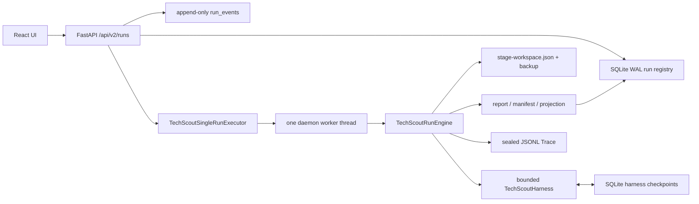
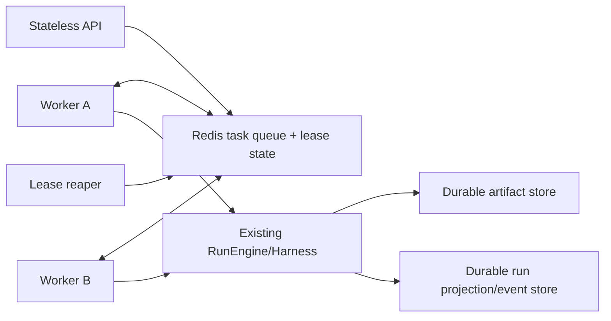

# 后端可靠性架构

## 1. 范围与结论

事实基线为 `750b17a`。当前 TechScout 是可恢复的本地单进程垂直切片，不是分布式任务平台。本轮文档计划保留现有 API 与 Harness 边界，在未来实现中用 Redis Worker/lease 替换进程内调度；本轮不修改生产代码。

## 2. 已实现

当前可靠性边界：

- `RunRegistry` 使用 SQLite WAL、`busy_timeout=5000` 和短事务；准入时在同一事务写 run 与首个事件。
- `claim_oldest_techscout` 通过 `BEGIN IMMEDIATE` 和条件更新实现单库内原子 claim，并拒绝在已有 `running` run 时再 claim。
- `TechScoutSingleRunExecutor` 只有一个进程内后台线程；Web 服务器固定 `workers=1`。
- Harness checkpoint 与 Web registry 分库/分文件保存；`stage-workspace.json` 使用临时文件、`fsync`、原子替换，并保留一个 backup。
- 执行完成时先写产物、记录并封存 Trace，随后把 `projection_path`、终态状态和终态事件写入同一 SQLite 事务。
- 执行异常会尝试生成失败投影与失败 manifest；若终态发布本身失败，最后兜底把仍为 `running` 的 run 标为 `failed`，释放本地队列。
- Web API 有统一错误 envelope、安全响应头、请求体大小与同源限制；默认仅监听 loopback，且没有认证。

## 3. 当前故障域与一致性窗口

| 故障点 | 当前行为 | 限制 |
|---|---|---|
| Web 进程退出 | 下次启动把 `queued/running` TechScout run 重新置为 `queued` | 没有 lease；无法区分仍存活的远端执行者 |
| stage 中断 | 若 workspace/checkpoint 已落盘，则 Harness 可恢复 | 恢复粒度受最近一次 checkpoint 约束 |
| 产物已写、registry 未终态 | 下次会重新入队并重新进入引擎 | 存在重复执行/覆盖中断 Trace 的窗口 |
| registry 终态事务 | 状态与终态事件一起提交 | 产物文件与 SQLite 不是一个原子事务 |
| 多进程同时启动 | TechScout executor 本身没有跨进程 owner lease | 当前依赖单 Uvicorn worker 与本地部署约束 |
| SQLite 或磁盘不可写 | 请求或终态发布失败 | 无外部队列/DLQ；需要人工检查磁盘和数据库 |

## 4. 本轮计划：目标分层

计划遵守以下模块边界：

- API 只负责校验、幂等准入、查询和取消意图，不在请求线程内执行任务。
- Redis 只拥有调度态、lease 与短期去重，不成为报告、Trace 或业务事实的唯一持久化来源。
- Worker 通过现有 `TechScoutRunEngine`/Harness 接口执行，不让调度协议渗入确定性阶段逻辑。
- 运行投影、事件和产物仍需持久化；最终采用何种数据库/对象存储尚未实现，也未在本文宣称已选型上线。
- claim、续租、完成和失败必须校验 fencing token，阻止过期 Worker 覆盖新 owner 的结果。

## 5. 未实现

- Redis 拓扑、高可用、持久化参数与容量验证。
- 独立 Worker 服务、水平扩容、优先级队列和公平调度。
- lease/heartbeat/reaper、fencing token、延迟重试和 dead-letter queue。
- 跨存储原子提交、outbox/inbox 或事务消息。
- 取消、暂停、人工重放、租户配额、认证授权和审计主体。
- 生产 SLO、告警阈值、容量数字或灾备目标；这些只能在部署与演练后确定。

## 6. 代码事实入口

- `paper_agent/web/registry.py`：SQLite schema、准入、claim、事件与终态事务。
- `paper_agent/web/techscout_execution.py`：单线程执行、checkpoint 恢复、失败投影与发布顺序。
- `paper_agent/web/app.py`：进程内组合、异常处理与安全边界。
- `paper_agent/web_server.py`：单 worker 与 loopback 默认值。
- `tests/web/test_registry.py`、`tests/web/test_techscout_wave2_e2e.py`：并发准入、队列释放与 checkpoint 恢复的确定性验证。
