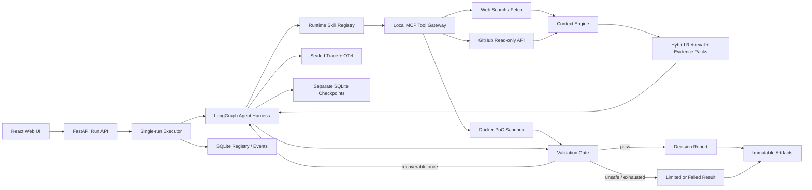

# MOMO TechScout Production Refactor Master Plan

> **Status:** Ready for implementation after plan review
>
> **Date:** 2026-08-09
>
> **Planning baseline:** `origin/master@4b1cdf5d46a4977c1963b765023b489f3104c178`
>
> **Delivery priority:** stable and fast terminal output first; deeper quality second
>
> **Important:** every number marked as a target is a planning target, not a resume claim. Resume data must be generated from the sealed final evaluation package.

## 1. Project Positioning

### 1.1 One-sentence definition

**MOMO TechScout is an evidence-grounded research and verification Agent for Python AI application developers choosing open-source components.** Given a project environment, hard constraints, and two or three candidate components, it plans the investigation, searches official documentation and GitHub, loads stage-specific Skills, calls tools through MCP, runs allowlisted smoke tests in Docker, validates every important conclusion, and returns a traceable comparison report.

### 1.2 The real problem

AI developers choosing an open-source component currently have to move repeatedly among documentation, README files, releases, issues, installation instructions, and local experiments. Information often belongs to different versions, community claims are not always reproducible, and a recommendation without local verification is hard to trust.

TechScout reduces that work to one bounded workflow:

```text
Project requirements and candidates
→ planning
→ official documentation and GitHub research
→ evidence selection
→ sandboxed PoC
→ deterministic validation
→ one targeted recovery when needed
→ traceable comparison report
```

### 1.3 Deliberate scope

The first production version supports:

- public Python AI open-source components;
- two or three candidates per task;
- two or three explicitly supported component families, each backed by allowlisted PoC recipes;
- a research-only result for candidates without a trusted recipe; the system never guesses arbitrary installation commands;
- official documentation, GitHub repositories, releases, issues, and package metadata;
- Linux-container verification of installation, import, version, and an allowlisted feature smoke test;
- `fast` mode as the default and `verified` mode as an optional longer run;
- a research-only result when no trusted PoC recipe exists, clearly labeled as not locally verified.

The first version is **not**:

- a general decision Agent for travel, shopping, or consulting;
- a Coding Agent that modifies user repositories;
- a scientific-paper reading product, although a paper may be an optional source;
- an autonomous shell, general browser, Skills marketplace, or arbitrary MCP host;
- a multi-Agent role-play system;
- a production multi-tenant SaaS.

### 1.4 User-visible result

The default path must always reach an honest terminal artifact within a bounded time:

- `completed`: research, PoC, and all gates passed;
- `completed_with_limitations`: a useful report was produced, but one or more checks were unavailable or failed;
- `failed`: no safe, schema-valid report could be produced.

The `fast` mode planning target is a terminal artifact within 120 seconds for prewarmed benchmark cases. A timeout returns a partial, explicitly limited report instead of keeping the user in an unbounded Agent loop.

## 2. Why Refactor MOMO Scholar Instead of Starting Over

MOMO Scholar is not a failed project. It already has strong engineering assets:

- hybrid lexical/vector retrieval and RRF fusion;
- structured Evidence Packs and citation validation;
- provider timeouts, schema validation, one bounded provider retry, and usage accounting;
- immutable artifacts, manifests, sealed JSONL traces, secret sanitization, and optional OpenTelemetry export;
- resumable evaluation infrastructure;
- FastAPI run queue, SQLite WAL registry, React/Vite UI, OpenAPI contract generation, and offline demo;
- substantial deterministic backend and frontend tests.

The mismatch is the execution model and product story. The current main path is a fixed paper pipeline; it does not yet contain an LLM Planner, runtime Skills, MCP tool selection, Docker PoC execution, main-flow checkpoints, or targeted recovery.

Therefore the fastest credible path is:

1. preserve the existing Scholar result as a versioned baseline;
2. reuse generic retrieval, evidence, generation, trace, evaluation, API, and UI infrastructure;
3. replace paper-specific domain contracts and the fixed pipeline with the TechScout domain and bounded Agent Harness;
4. postpone mechanical package renaming until it can no longer endanger the vertical slice.

## 3. Project Principles and Their Proof

| Required principle | TechScout implementation | Evidence required before release |
|---|---|---|
| Real problem | Python AI component research plus reproducible verification | At least one end-to-end real selection scenario and a usable Web demo |
| Complete engineering loop | Input → Plan → Skill → MCP Tool → Execute → Validate → Report | Four offline vertical cases pass in CI |
| Real Agent decisions | LLM produces investigation plan, identifies evidence gaps, proposes bounded PoC, and reviews the report | Trace contains planning and review decisions; deterministic policy still controls safety |
| Context engineering | Stage-specific Skill loading, source filtering, per-candidate context packets, version/date filtering, token/tool budgets | Context-selection tests and retrieval evaluation |
| Quality gates | Build, lint, tests, review, report/evidence/PoC validation | All release gates pass |
| Failure recovery | Typed error classification, checkpoint, one targeted retry or cache fallback | Eight injected failure scenarios |
| Trace and observability | Skill, MCP tool, state, latency, tokens, errors, retry, recovery, and terminal result | Sealed trace verifier passes |
| Evaluation | Fixed tasks, fixed configuration, baseline/final comparison, generated metric summary | Sealed final evaluation package |
| Human approval | Only policy-defined high-risk operations can interrupt for approval | Approval allow/deny tests |
| Security boundary | No arbitrary shell; Docker resource limits, network policy, URL validation, timeouts, and tool allowlists | Security-focused unit and sandbox smoke tests |

## 4. Target Architecture



### 4.1 Bounded graph

The Harness uses an explicit state graph, not an open-ended ReAct loop:

```text
normalize_request
→ plan_research
→ research_candidates
→ select_context
→ plan_poc
→ execute_poc
→ validate
→ recover_once? ─┐
→ review_report  │
→ publish        ┘
```

Default execution limits:

- maximum three candidates;
- maximum two search queries per candidate;
- maximum five retained sources per candidate;
- maximum 16 graph steps;
- maximum one recovery attempt for the failed stage only;
- hard per-tool and whole-run timeouts;
- no automatic restart of the entire run;
- deterministic terminalization when the budget is exhausted.

LLMs handle diagnosis, planning, evidence-gap analysis, PoC proposal, and report review. Code handles state transitions, permissions, budgets, command compilation, validation, and terminal status.

LangGraph is only a thin orchestration shell around the stage services, typed state, and conditional routing. Retrieval, MCP tools, Skills, validation, sandboxing, and business rules remain ordinary testable modules outside the graph.

### 4.2 Runtime Skills

Runtime Skills are product capabilities, not the repository's development-agent instructions. Store them under `paper_agent/techscout/runtime_skills/` to avoid confusing them with `.agents/skills`.

Initial fixed Skills:

1. `official-doc-research`;
2. `github-project-analysis`;
3. `python-package-smoke-test`;
4. `failure-diagnosis`.

Every `SkillSpec` declares:

- version and intended stage;
- instructions and completion criteria;
- allowed MCP tools;
- typed input and output contracts;
- source, tool-call, step, and token budgets;
- error types it may handle.

The Planner emits required capabilities; the policy-controlled router maps them to a valid Skill. Only the current Skill instructions and tools enter the prompt. There is no automatic Skill generation or remote Skill marketplace.

### 4.3 MCP tool boundary

Use the official stable MCP Python SDK and a real local stdio server/client boundary. The first Tool Gateway exposes only:

- `web.search`;
- `web.fetch`;
- `github.inspect_repository`;
- `sandbox.run_smoke_test`.

All tool inputs and outputs are schema-validated. The client caches tool discovery for the run. The Skill allowlist and local policy must both permit a tool call. MCP annotations are treated as metadata, never as the security boundary.

No arbitrary third-party MCP server can be added at runtime. MCP resources/prompts and Streamable HTTP are out of scope unless a later concrete requirement needs them.

### 4.4 Context engine and RAG

Reuse the existing lexical/vector retrieval, embedding adapter, RRF fusion, Evidence Pack, and evidence validation after generalizing paper-specific models to `SourceDocument`, `SourceChunk`, and `CandidateEvidence`.

Context is loaded by stage:

| Stage | Context made available |
|---|---|
| Intake and planning | User request, normalized constraints, candidate names, Skill summaries |
| Research | One candidate, relevant constraints, search history, source metadata |
| PoC planning | Candidate version, supported constraints, selected evidence, trusted recipe schema |
| Validation | Structured evidence index, PoC result, gate rules, prior error if recovering |
| Reporting | Validated claims, source citations, PoC results, risks, limitations |

Raw pages, complete repository content, and unrelated candidate context are not copied into every prompt. Sources are normalized, deduplicated, version/date filtered, hashed, and stored with `as_of` provenance. Live search uses a bounded cache; Benchmark uses frozen source snapshots.

### 4.5 Validation and recovery

The deterministic gate checks:

- request and report schema validity;
- coverage of every hard constraint;
- official/GitHub evidence availability and resolvable citations;
- candidate/version consistency;
- PoC recipe trust level, exit code, timeout, and artifact integrity;
- no unsupported critical recommendation;
- trace and terminal manifest completeness.

Recovery is typed and local:

| Failure | Recovery action |
|---|---|
| Search timeout or 429 | use valid cache, otherwise one bounded search retry |
| Page parsing failure | fetch an alternate official/GitHub source |
| Malformed MCP response | reject the response and repeat that tool call once |
| Dependency/version conflict | diagnose, pin one compatible version, rerun the PoC stage once |
| PoC timeout or non-zero exit | produce a structured diagnosis; rerun only when the diagnosis maps to an allowed fix |
| Report schema or evidence failure | repair only the report/review stage |
| Unsafe request or exhausted budget | stop and publish an honest limited result or fail safely |

The first failed trace remains immutable. A recovery trace links to its checkpoint and records exactly which stage was repeated.

### 4.6 Human-in-the-loop policy

Normal read-only research and allowlisted sandbox tests do not interrupt the user. This preserves speed.

An approval is required only for a request to:

- write outside the run workspace;
- delete files;
- execute an untrusted or non-allowlisted command;
- access a non-approved network destination;
- mount a host path or expose a host secret;
- perform any operation later classified as destructive or externally mutating.

The default response to an unavailable approval is denial, not implicit execution.

## 5. Technology Stack Decisions

| Layer | Decision | Reason |
|---|---|---|
| Language and API | Keep Python 3.10+, FastAPI, Pydantic v2, Uvicorn, httpx | Already tested; no migration value |
| Agent orchestration | Add LangGraph 1.x with explicit `ResearchState` | Checkpointed, inspectable, bounded state transitions instead of a fixed pipeline |
| Checkpointing | Add `langgraph-checkpoint-sqlite`; use a separate checkpoint DB | Enables local stage resume without coupling third-party tables to the run registry |
| LLM | Keep the existing `GenerationProvider` seam and DashScope/Qwen first | Avoid a multi-provider platform rewrite |
| Skills | Static, versioned `SkillSpec` files plus validated registry/router | Dynamic context without uncontrolled prompt files |
| MCP | Official MCP Python SDK stable v2 line; local stdio Tool Gateway | Real client/server tool boundary with low deployment complexity |
| Live search | `SearchAdapter` with one Tavily HTTP implementation; GitHub REST via httpx | One provider is enough; domain filters and fast search fit the time budget |
| RAG | Reuse lexical + Bailian embedding/vector + RRF and per-run memory store | Existing measured asset; no new vector infrastructure needed |
| Sandbox | Docker CLI with explicit argv, prebuilt image, CPU/memory/PID/time/network limits | Reproducible PoC without host shell access |
| Run database | Keep SQLite WAL | Correct for one local process and low write concurrency |
| Durable artifacts | Keep immutable filesystem JSON/JSONL/Markdown plus SHA-256 manifests | Existing source of truth and audit trail |
| Trace | Extend current sealed JSONL; keep OpenTelemetry/OTLP optional | Do not replace working observability |
| Frontend | Keep React 19, TypeScript, Vite, Router, native fetch, Markdown, Vitest | Approximately 60–70% of the shell can be reused |
| CI | GitHub Actions, pytest, minimal Ruff, Vitest, TypeScript build, Docker smoke | Provides the required Build/Lint/Test/Validation gates |

Relevant primary references:

- [LangGraph persistence and checkpoints](https://docs.langchain.com/oss/python/langgraph/persistence)
- [MCP Python SDK](https://py.sdk.modelcontextprotocol.io/)
- [SQLite WAL](https://www.sqlite.org/wal.html)
- [SQLite appropriate uses](https://sqlite.org/whentouse.html)
- [Tavily Search API](https://docs.tavily.com/documentation/api-reference/endpoint/search)

### 5.1 SQLite decision

**Do not replace SQLite.** The application is a single-user local portfolio product with one active executor and low write concurrency. PostgreSQL, Redis, Celery, and a remote vector database add deployment and debugging cost without improving the project claim.

Keep three storage authorities:

1. `run-registry.sqlite3`: queue, run summaries, approvals, and append-only UI event index;
2. `agent-checkpoints.sqlite3`: LangGraph checkpoints only;
3. `outputs/<run_id>/`: immutable source snapshots, evidence, PoC logs, reports, trace, and terminal manifest.

Add WAL and `busy_timeout` to both local databases. Add a versioned migration for `run_events`; do not add an ORM or Alembic in the first release. Move to PostgreSQL only together with a real multi-process/multi-machine worker requirement.

### 5.2 Frontend decision

Do not rewrite the frontend and do not add Next.js, Redux, TanStack Query, Tailwind, WebSocket, a component library, or a chart library.

Refactor the existing screens:

- `/`: new task plus recent runs;
- `/runs/:id`: five user-facing stages, elapsed time, current Skill/tool, recovery/approval summary, and a collapsed Trace feed;
- `/runs/:id/report`: recommendation, comparison table, hard-constraint results, PoC results, risks, limitations, and evidence;
- `/runs/:id/candidates/:candidateId`: candidate version, compatibility, evidence, and PoC details;
- `/runs/:id/evidence/:evidenceId`: official documentation, GitHub, or PoC evidence.

Keep the existing two-second polling with backoff. Add a cursor-based Trace endpoint rather than sending unbounded events or building WebSocket/SSE infrastructure.

## 6. Domain and Artifact Contracts

Freeze these contracts before parallel implementation:

- `ResearchRequest`: question, project context, Python/OS/deployment environment, hard constraints, optional candidates, mode;
- `Candidate`: identity, repository, package, requested/resolved version;
- `ResearchPlan`: investigation dimensions, required capabilities, planned evidence, PoC intent;
- `SkillSpec` and `SkillSelection`;
- `ToolCall` and `ToolResult`;
- `SourceDocument`, `SourceChunk`, and `CandidateEvidence`;
- `PocPlan`, `PocResult`, and `PocArtifact`;
- `GateDecision` and typed `Failure`;
- `ResearchState` and checkpoint metadata;
- `DecisionReport` and terminal `RunManifest` projection.

Required terminal artifacts:

```text
request.json
research-plan.json
source-snapshots.jsonl
evidence.jsonl
poc-plan.json
poc-results.json
decision-report.json
decision-report.md
traces.jsonl
run_manifest.json
```

The JSON contracts are authoritative. Markdown and API responses are projections and must never invent information absent from the validated JSON.

## 7. Delivery Strategy

### 7.1 Schedule and resume-ready checkpoint

The plan is optimized for four concurrent workers plus one integration owner. Calendar estimates are sequencing targets, not guarantees.

| Wave | Scope | Parallelism | Target elapsed time | Merge result |
|---|---|---:|---:|---|
| 0 | Foundation, contracts, CI | Mostly serial | 0.5–1 day | Safe base for parallel work |
| 1 | Harness / Tools+Context / Sandbox+Gates / Web shell | Four streams | 2 days | All deep-module seams implemented with fakes |
| 2 | Live adapters and first vertical slice | Three to four streams | 1–1.5 days | Resume-ready working demo |
| 3 | Recovery, security, Trace, UX, offline demo | Four streams | 1–1.5 days | Production-reliability story complete |
| 4 | Final evaluation and hardening | Parallel test jobs | 0.5–1 day | Sealed real metrics |
| 5 | Documentation, demo, release, resume evidence | Three streams | 0.5–1 day | Finished project |

Expected total: **five to seven focused working days** if provider credentials and Docker are available. The first resume-ready vertical slice appears after Wave 2; final metrics do not block implementation or the first project description.

### 7.2 Branch ownership

After the Foundation PR merges, create independent branches/worktrees from the same updated base:

- `codex/techscout-harness` owns graph, state, planner, and checkpoint code;
- `codex/techscout-tools-context` owns Skills, MCP, search, GitHub, cache, and context selection;
- `codex/techscout-sandbox-recovery` owns Docker runner, PoC recipes, validation, safety, and recovery;
- `codex/techscout-web-eval` owns Web/API projections, Trace feed, fixtures, and evaluation integration.

The integration owner alone changes shared dependency files, generated OpenAPI contracts, central manifests, and merge-sensitive schemas after Foundation. Agents do not share a worktree.

## 8. Implementation Chunks

## Chunk 0 — Foundation and Contract Freeze

### Task 0.1 — Preserve the Scholar baseline and record the product decision

**Deliverables**

- preserve `4b1cdf5` as the Scholar closeout baseline/tag before domain replacement;
- add an architecture decision documenting the TechScout positioning, scope, non-goals, and migration strategy;
- expose the product name `MOMO TechScout` in new documentation without yet renaming every Python import.

**Acceptance**

- the previous Scholar artifacts and documented metrics remain attributable to Scholar only;
- no old metric is relabeled as a TechScout result;
- no paper feature is deleted before the TechScout vertical slice exists.

### Task 0.2 — Add strict TechScout domain and state contracts

**Likely files**

- create `paper_agent/techscout/models.py`;
- create `paper_agent/techscout/state.py`;
- create `paper_agent/techscout/errors.py`;
- create focused tests under `tests/techscout/`;
- project the new API models without replacing old routes yet.

**Acceptance**

- unknown fields are rejected;
- state and artifacts are JSON serializable;
- run/candidate/source/version identifiers are stable;
- gate and failure enums cover every planned recovery branch;
- contract tests are deterministic and offline.

### Task 0.3 — Establish the minimum CI and lint baseline

**Deliverables**

- `.github/workflows/ci.yml` with parallel Python, Web, Agent smoke, and later Docker jobs;
- minimal Ruff correctness rules first (`E9`, `F63`, `F7`, `F82`) so lint does not become a repository-wide formatting project;
- three frozen vertical fixtures using fakes;
- dependency and npm caches plus `concurrency.cancel-in-progress`.

**Acceptance**

- Python tests, Web tests, OpenAPI contract check, Web build, lint, CLI/package smoke, and three Agent smoke cases are visible checks;
- CI contains no provider secrets, paid calls, or live Internet dependency;
- Foundation is reviewed and merged before feature branches begin.

## Chunk 1 — Four Parallel Core Streams

### Stream A — Agent Harness

**Deliverables**

- `ResearchState` LangGraph graph;
- structured planning and report-review nodes;
- explicit conditional edges and terminal statuses;
- step, tool, token, and whole-run budgets;
- separate SQLite checkpointer;
- fake `ToolRuntime` and deterministic graph tests.

**Acceptance**

- a frozen request reaches a valid report through the full graph using fakes;
- interruption resumes from the last checkpoint;
- a successful completed node is not executed again during local recovery;
- graph termination remains bounded under malformed model output.

### Stream B — Skills, MCP, Search, and Context

**Deliverables**

- validated `SkillRegistry` and the four fixed Skills;
- real local stdio MCP server and client session;
- fake and real `ToolRuntime` adapters;
- Tavily search, HTTPS fetch, and GitHub read-only adapters;
- URL and response-size validation, timeout, cache, provenance, and snapshot hashing;
- generalized hybrid retrieval and per-stage context packets.

**Acceptance**

- only tools allowed by both Skill and local policy can execute;
- MCP inputs/outputs fail closed on schema errors;
- cache fallback is explicit in evidence and Trace;
- context tests prove unrelated candidates/full pages are excluded;
- all external adapters have deterministic fakes.

### Stream C — Sandbox, Validation, and Recovery

**Deliverables**

- structured `PocPlan` compiled into allowlisted argv;
- prebuilt Docker sandbox image and runner;
- CPU, memory, PID, disk, timeout, mount, secret, and network boundaries;
- trusted smoke-recipe registry;
- deterministic Validation Gate;
- typed error classifier and one-stage recovery policy;
- approval policy for high-risk requests.

**Acceptance**

- the LLM cannot send raw shell text to `subprocess` or use `shell=True`;
- an installation stage may use controlled network access, while test execution defaults to no network;
- timeout and non-zero exit produce bounded structured results;
- unknown recipes downgrade to research-only rather than executing guessed commands;
- destructive and host-level operations are denied or interrupted for approval.

### Stream D — API and Web Shell

**Deliverables**

- v2 run request/progress/report/candidate/evidence projections;
- SQLite `run_events` migration and cursor-based Trace endpoint;
- new task form and recent-run summary;
- five-stage run timeline and current Skill/tool status;
- report, candidate, evidence, recovery, and approval UI skeletons;
- generated TypeScript contracts and fixture-based tests.

**Acceptance**

- existing queue, pagination, polling/backoff, security headers, artifact allowlist, and offline-mode warning remain intact;
- Trace payloads are cursor-limited and sanitized;
- no WebSocket/SSE or new state-management framework is introduced;
- frontend tests and production build pass offline.

## Chunk 2 — Vertical Integration and Live Adapters

### Task 2.1 — Connect the first complete fast-mode workflow

Integrate:

```text
Web request
→ FastAPI queue
→ LangGraph plan
→ official/GitHub research through MCP
→ context selection
→ validated report
→ UI and artifact download
```

Use one understandable showcase scenario, initially a Python RAG component comparison with two or three candidates and pinned environment constraints.

**Acceptance**

- one live-bounded task and one fully offline replay reach honest terminal artifacts;
- the report distinguishes retrieved facts, local measurements, inferences, and limitations;
- every critical claim opens a source or PoC artifact;
- provider/search timeout still reaches a bounded terminal result;
- no final benchmark is required yet.

### Task 2.2 — Integrate PoC and final gate

**Acceptance**

- supported candidates run a common smoke contract inside Docker;
- unsupported candidates are labeled research-only;
- PoC results include environment, resolved version, command identity, exit status, timings, stdout/stderr digests, and artifact hashes;
- Validation Gate, not the LLM, decides whether a fully verified report may publish.

### Task 2.3 — Produce the resume-ready checkpoint

At this point update the README with:

- the precise project definition;
- one 30-second workflow graphic/GIF or short recording;
- local quick start and offline demo;
- architecture and safety boundaries;
- preliminary engineering facts only.

Do not publish target percentages as measured results.

## Chunk 3 — Reliability, Trace, and UX Hardening

### Task 3.1 — Add targeted recovery end to end

**Acceptance**

- search, MCP, dependency, PoC, and report validation failures map to different actions;
- at most one failed stage is rerun;
- completed search/context/PoC work is reused from checkpoint where valid;
- UI displays checkpoint, failed stage, recovery action, and outcome;
- exhausted recovery ends as limited/failed without restarting the run.

### Task 3.2 — Extend sealed Trace instead of replacing it

Record:

- `plan.created` and planning decision summary;
- `skill.selected`;
- MCP tool start/end, safe parameters, status, latency, and cache state;
- checkpoint and state transition;
- Validation Gate result;
- error classification, retry, and recovery link;
- per-call tokens/cost where available;
- terminal result and artifact hashes.

**Acceptance**

- Trace sanitization and sealing still pass;
- prompts, secrets, raw provider bodies, absolute host paths, and unbounded stdout do not enter the Trace;
- optional OTLP export failure cannot change the local terminal artifact.

### Task 3.3 — Finish the user experience and offline demo

**Acceptance**

- default form is understandable without Agent terminology;
- advanced settings are collapsed;
- the run page shows progress and elapsed time before detailed Trace;
- the report starts with recommendation, reason, hard constraints, and what was locally measured;
- offline synthetic data is visibly labeled and never used as benchmark evidence;
- desktop and narrow browser smoke checks pass.

## Chunk 4 — Evaluation Without a Data Trap

### Task 4.1 — Build the fixed task set once

Final evaluation scope:

- 12 end-to-end component-selection tasks;
- 40 offline retrieval/version-filter cases;
- eight injected recovery scenarios.

During ordinary development, use only three frozen smoke tasks. The complete set is not a per-PR gate. Expand to 12 tasks only after the vertical slice is stable, and derive the 40 retrieval cases from those tasks' constraint dimensions and pinned official source IDs instead of creating an unrelated annotation project.

### Task 4.2 — Define objective metrics

`Task Success` requires all of:

- terminal report schema valid;
- every hard constraint addressed;
- required official/GitHub evidence available;
- expected PoC result present when the task supports PoC;
- Validation Gate passed;
- terminal artifacts and sealed Trace complete.

Also record:

- First-pass Success;
- Recovery Success Rate;
- Recall@5 and version-filter accuracy;
- tool-call schema validation and execution success;
- average recovery stages and retries;
- p50/p95 latency;
- tokens and estimated cost per successful task.

Cold-live and warm-cache latency must be reported separately; they must never be combined into one headline latency number.

### Task 4.3 — Run Baseline and Final exactly once

Use the same model, temperature, task fixtures, search snapshots, concurrency, and timeout for both configurations:

- V0: same core model/tools, but no stage-specific Skill loading or targeted recovery;
- V1: final TechScout Harness.

MOMO Scholar is not a TechScout baseline. V0 and V1 run the same TechScout tasks, candidates, model, tools, and frozen inputs; only the explicitly named Harness capability may differ.

Execution budget:

- 24 end-to-end runs total (`12 × V0/V1`);
- four workers;
- 120-second hard timeout per case;
- 20–30 minute target, 60-minute absolute ceiling;
- one rerun only for a proven infrastructure failure, preserving the original failed Trace;
- no repeated prompt tuning to make the percentages look better.

The 40 retrieval cases and eight failure injections run offline. The evaluation runner generates `eval-summary.json`, a sealed evidence package, and a resume-evidence projection automatically.

Planning targets, not release blockers:

| Metric | Baseline target | Final target |
|---|---:|---:|
| Task Success | 6/12 | 9/12 |
| First-pass Success | 5/12 | 8/12 |
| Retrieval Recall@5 | 33/40 | 38/40 |
| Recovery Success | n/a | 6/8 |
| Fast-mode tasks within 120 s | n/a | 11/12 |
| Prompt tokens | baseline | at least 25% lower |

If a target is missed, publish the real result and limitation. Do not block the release by rerunning until a prettier number appears.

## Chunk 5 — Final Quality Gate and Release

### Task 5.1 — Required quality gates

Every feature PR runs focused tests. The final release runs:

1. **Build** — Python package/CLI smoke, TypeScript/Vite production build, Docker sandbox build;
2. **Lint** — Ruff correctness rules and TypeScript compiler;
3. **Test** — full offline pytest and Vitest suites;
4. **Review** — separate Standards and Spec review of the final diff;
5. **Validation Gate** — three frozen Agent smokes, sandbox no-network smoke, Trace/artifact verification, desktop/narrow browser smoke;
6. **Final Eval** — the bounded one-time 12/40/8 run from Chunk 4.

Live API credentials are never placed in CI. A missing optional live provider blocks only the live final metric, not deterministic engineering verification; no metric is fabricated.

### Task 5.2 — Packaging and user delivery

Deliver:

- `docker compose up` local Web experience;
- one prebuilt/locally buildable sandbox image;
- `.env.example` containing names, never secret values;
- fast offline demo and one documented live path;
- README architecture, quick start, failure semantics, security boundaries, and evaluation results;
- downloadable Markdown/JSON report and Trace artifacts;
- a concise demo runbook.

### Task 5.3 — Product rebrand and legacy handling

- preserve the Scholar baseline in Git history/tag;
- rename user-visible product, CLI command, README, API title, and Web metadata to MOMO TechScout;
- keep internal `paper_agent` imports during the critical path if renaming would risk delivery;
- decide on a single atomic internal package rename only after every release gate passes;
- never retain both paper and TechScout product stories in the final README as if they were one benchmark.

Internal package renaming is not a release blocker. A coherent working product is more valuable than a large mechanical diff.

### Task 5.4 — Resume and interview evidence

Keep implementation authority and interview material separate:

- `docs/evaluation/` contains measured results, methods, hashes, and limitations;
- `docs/interview-preparation/` may contain the four resume bullets and story, populated only from measured authority;
- README states only reproducible facts.

The final story is:

1. MOMO Scholar had strong RAG/evidence infrastructure but a fixed and less compelling paper workflow;
2. the project was reframed around a real Python AI component-selection problem;
3. generic assets were retained while a bounded LangGraph Harness, runtime Skills, MCP tools, Docker verification, checkpoint recovery, and deterministic gates were added;
4. fixed evaluation and Trace exposed failure types and measured whether the new mechanisms improved success, speed, and cost.

## 9. Automatic Commit, Push, Review, and Merge Policy

The user's instruction in this task authorizes normal scoped commit, push, and merge for the TechScout implementation after the gates below pass. It does not authorize force push, reset, clean, secret publication, release deployment, or destructive workspace cleanup.

Workflow for every branch:

1. inspect current branch/worktree and preserve unrelated changes;
2. implement only the assigned files and contract;
3. run focused tests plus `git diff --check`;
4. commit the scoped changes;
5. push the branch and create/update a Draft PR;
6. wait for required CI;
7. run Standards and Spec review;
8. repair only actionable failures in the owning branch;
9. when checks and review pass, mark ready and normally squash/merge;
10. update the integration base before starting the next dependent wave.

Before CI exists, the Foundation PR requires the equivalent local full gate and explicit diff review. After CI exists, independent PRs may use GitHub auto-merge. Any conflict, failed check, pending approval, or unresolved review stops automatic merge and returns control to the integration owner.

Do not delete old worktrees or branches as part of delivery; cleanup is separate and non-blocking.

## 10. Stop Rules and Scope Guards

Immediately defer an idea when it requires any of the following without directly satisfying a release gate:

- PostgreSQL, Redis, Celery, Kubernetes, or a distributed queue;
- a persistent external vector database;
- multiple search vendors or an LLM-provider marketplace;
- arbitrary remote MCP servers;
- automatic Skill generation;
- unrestricted shell/browser tools;
- more Agent roles;
- WebSocket/SSE, auth, billing, or multi-user collaboration;
- a complete package rename before the vertical slice;
- a larger benchmark, repeated judge passes, or repeated tuning for better numbers;
- cloud deployment before the local Docker demo and README are complete.

When a feature threatens the five-to-seven-day path, preserve its interface only if already required; otherwise record it under future work and continue the critical path.

## 11. Definition of Done

The project is finished only when all of the following are true:

- a user can create a real component-selection task from the Web UI;
- the Harness visibly plans, selects a Skill, calls MCP tools, and manages typed state;
- official/GitHub evidence is dynamically retrieved, filtered, cited, and cached;
- at least one supported scenario executes a Docker PoC through an allowlisted plan;
- deterministic gates decide report publication;
- one injected failure recovers from a checkpoint without replaying the full run;
- unsafe operations are denied or require approval;
- terminal artifacts, tokens, latency, errors, retries, and recovery are visible in a sealed Trace;
- Build, Lint, Test, Review, and Validation gates pass;
- the bounded 12/40/8 evaluation has one sealed result, even if targets are missed;
- README, offline demo, Docker quick start, architecture, limitations, and demo runbook are complete;
- resume bullets contain only automatically projected measured data;
- all scoped branches are normally pushed and merged, with no unrelated user changes included.

## 12. Tiny Commit Sequence

Every commit below must leave its branch's focused tests green. Shared contracts and dependency files remain integration-owner changes.

1. `docs: record TechScout positioning and V1 support matrix`
2. `test: define strict TechScout request and report behavior`
3. `feat: add TechScout domain contracts and typed failures`
4. `test: add three frozen vertical smoke fixtures`
5. `ci: add offline Python Web and Agent checks`
6. `build: add minimal Ruff correctness gate`
7. `feat: add validated runtime Skill specifications`
8. `feat: add Skill registry and stage router`
9. `feat: define typed MCP tool request and result contracts`
10. `test: add fake Tool Runtime behavior`
11. `feat: add local stdio MCP Tool Gateway`
12. `feat: add bounded official search and fetch adapter`
13. `feat: add read-only GitHub inspection adapter`
14. `feat: add source snapshot hashing and cache fallback`
15. `feat: generalize Evidence Packs for candidate sources`
16. `feat: add stage-scoped context selection`
17. `feat: add Research State and bounded graph shell`
18. `feat: add structured planning and report review nodes`
19. `feat: enforce graph step tool token and deadline budgets`
20. `feat: persist graph checkpoints in separate SQLite storage`
21. `feat: define trusted PoC plans and recipe registry`
22. `build: add pinned Docker sandbox image`
23. `feat: execute allowlisted PoC recipes with resource limits`
24. `feat: add deterministic Validation Gate`
25. `feat: add typed failure classification and one-stage recovery`
26. `feat: add high-risk approval policy`
27. `feat: add append-only run events and Trace cursor`
28. `feat: project TechScout run and report API contracts`
29. `feat: replace the paper form with TechScout task input`
30. `feat: render progress Skills tools and recovery state`
31. `feat: render report candidate PoC and evidence views`
32. `feat: extend sealed Trace with Agent and MCP events`
33. `test: add eight deterministic recovery injections`
34. `feat: add the cached offline TechScout demo`
35. `eval: add the fixed 12 task and 40 retrieval runners`
36. `ci: add Docker build and no-network sandbox smoke`
37. `docs: publish quick start architecture and demo runbook`
38. `chore: switch user-visible branding and CLI to TechScout`
39. `eval: seal final measurements and resume evidence`
