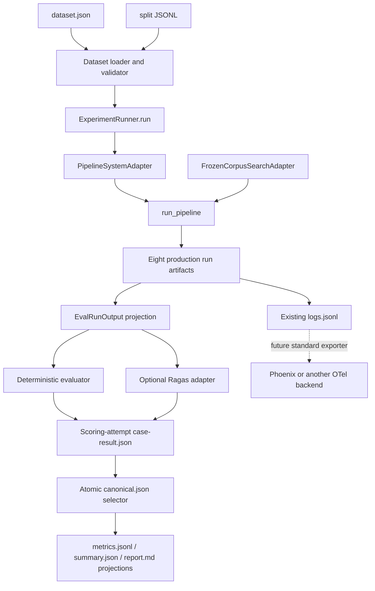

# MOMO Scholar Engineering-Grade RAG Evaluation Design

**Status:** implementation-ready draft
**Date:** 2026-07-23
**Baseline:** `origin/master@3f75bfb` (`766` tests passing)  
**Scope:** evaluation contracts, public-dataset adapters, experiment execution,
deterministic headline metrics, optional Ragas evaluation, and dataset provenance.

## 1. Purpose

MOMO Scholar already records auditable pipeline artifacts and has deterministic
metric primitives. The next stage must answer three separate questions:

1. Did retrieval find the right papers and evidence?
2. Is the generated answer grounded and responsive?
3. Can a result be reproduced, compared with a baseline, and traced to the exact
   run artifacts that produced it?

The design keeps those concerns behind a small experiment interface. Public
dataset formats, Ragas types, and the current filesystem layout remain adapters,
not the evaluation domain model.

This stage does **not** add Redis, a web application, reranking, OCR, a vector
database, or production monitoring. Redis remains a later execution adapter for
queues, leases, progress, and cancellation; it will not become the authority for
gold data or experiment results.

## 2. Design principles

- The production pipeline is the system under test (SUT). Evaluation must not
  reimplement it.
- Gold data is framework-neutral and versioned.
- Deterministic metrics remain usable without Ragas, DashScope, Phoenix, or a
  network connection.
- Semantic evaluation is explicitly enabled and independently fallible.
- A failed case is recorded and does not erase the experiment.
- There is no combined “RAG score.” Retrieval, grounding, generation, completion,
  latency, and usage remain separate.
- Raw pipeline artifacts and immutable gold cases are authorities; summaries and
  Markdown reports are reproducible projections.

## 3. System context and data flow



The evaluation module has one external execution seam:

```python
class EvaluationSystem(Protocol):
    def run(
        self,
        case: EvalCase,
        *,
        case_output_dir: Path,
        config: SystemRunConfig,
        correlation: EvaluationCorrelation,
    ) -> EvalRunOutput: ...
```

The production adapter and an in-memory fake are the first two adapters, making
this a real seam. Tests exercise the runner through the same interface used by the
production adapter.

## 4. Packages and module responsibilities

```text
paper_agent/eval/
├── contracts.py              # gold, output, metric, case and experiment models
├── dataset.py                # manifest/split loading and cross-file validation
├── system.py                 # EvaluationSystem and PipelineSystemAdapter
├── experiment.py             # lifecycle, resume, aggregation and comparison
├── matching.py               # deterministic gold-to-actual evidence matching
├── metrics.py                # existing metrics plus headline metric functions
├── report.py                 # projections only
├── datasets/
│   ├── scifact.py
│   └── qasper.py
└── semantic/
    ├── contracts.py          # SemanticEvaluator interface
    ├── ragas.py              # optional adapter
    └── fake.py
```

Existing `evaluate_fixture` and `evaluate_retrieval_fixture` remain supported.
They are small offline regression tools, not aliases for the new experiment
runner. Migration or removal is out of scope.

## 5. Dataset contract

### 5.1 Dataset manifest

Each dataset directory contains `dataset.json` and three JSONL split files:

```json
{
  "schema_version": "1.0",
  "dataset_id": "momo-scifact-eval-example",
  "dataset_version": "2026.07.1",
  "sources": [
    {
      "name": "SciFact",
      "upstream_version": "pinned-release-or-commit",
      "assets": [
        {
          "asset_type": "annotations",
          "source_url": "https://github.com/allenai/scifact",
          "license_id": "CC-BY-4.0",
          "redistribution": "converted-annotations-allowed"
        },
        {
          "asset_type": "corpus",
          "source_url": "https://github.com/allenai/scifact",
          "license_id": "ODC-By-1.0",
          "redistribution": "attribution-required"
        }
      ]
    }
  ],
  "splits": {
    "development": {"path": "development.jsonl", "count": 5},
    "validation": {"path": "validation.jsonl", "count": 20},
    "test": {"path": "test.jsonl", "count": 5}
  },
  "source_split_counts": [
    {"source": "SciFact", "development": 5, "validation": 20, "test": 5}
  ],
  "conversion_version": "scifact-v1"
}
```

The full V1 manifest declares the exact source-by-split matrix in Section 5.2,
not separate row and column totals that could hide source swaps. Selected-split
loading validates only its authorized split and never opens an unselected test
file. A separate audit validates development and validation together by default;
including test labels requires explicit authorization.

The loader rejects unknown schema major versions, duplicate case IDs within the
authorized set, missing provenance, incorrect source-by-split counts, unsafe or
aliased audited paths, and a case whose `metadata.split` disagrees with its file.

### 5.2 V1 split counts

V1 contains exactly 90 curated cases:

| Source | Development | Validation | Test | Total |
|---|---:|---:|---:|---:|
| SciFact | 5 | 20 | 5 | 30 |
| QASPER | 5 | 20 | 5 | 30 |
| MOMO | 2 | 10 | 2 | 14 |
| ScholarQABench | 3 | 10 | 3 | 16 |
| **Total** | **15** | **60** | **15** | **90** |

Development is inspectable and used for debugging. Validation is the 60-case
engineering baseline previously agreed for tuning and comparison. Test labels are
not consumed by routine development commands and are run only for milestones.
ScholarQABench-compatible cases enter V1 only after their individual
redistribution terms are recorded; otherwise placeholders are not counted and
dataset validation fails. LitQA2 is excluded from V1.

### 5.3 EvalCase

```python
TaskType = Literal[
    "paper_retrieval",
    "evidence_retrieval",
    "single_paper_qa",
    "claim_verification",
    "multi_paper_synthesis",
]

class EvalCase(StrictModel):
    schema_version: Literal["1.0"]
    case_id: str
    task_type: TaskType
    question: str
    corpus: CorpusConstraint
    reference: CaseReference
    rubric: list[RubricItem] = []
    metadata: CaseMetadata
```

`CorpusConstraint` contains the allowed canonical paper IDs, the expected content
SHA-256 when content is frozen, and enough public metadata to construct existing
`Paper` objects. A missing `content_sha256` is valid only for pure
`paper_retrieval`; every content-dependent task requires a hash for each corpus
paper. `CaseReference` may contain relevant paper IDs, reference evidence,
reference claims, an answer, and an unanswerable flag. Fields that are not
applicable are absent, not empty values with ambiguous meaning.

Canonical paper IDs use the existing repository representation. Dataset adapters
perform normalization once during conversion; metric code uses exact matching.

### 5.4 Reference evidence and claims

Reference evidence stores a stable upstream locator when one exists, canonical
paper ID, content hash, source type, optional page/section, the minimal reference
quote, graded relevance, and whether it is required. It never depends on MOMO's
generated `chunk_id`.

Reference claims contain stable IDs, text, importance (`critical` or `normal`),
stance (`supported`, `refuted`, or `forbidden`), required status, and supporting
reference-evidence IDs. Dataset validation rejects dangling IDs.

## 6. Dataset adapters and licensing

The SciFact and QASPER adapters are conversion tools:

```text
upstream pinned files -> validate upstream shape -> normalize IDs and labels
-> emit EvalCase JSONL -> write conversion/provenance receipt
```

They do not run the pipeline or calculate metrics. Conversion is deterministic
and records upstream file hashes, adapter version, timestamp, asset-specific
source URL and license, and whether transformed records may be committed. A code
repository license never substitutes for the terms of dataset annotations or
corpus text. SciFact claims/evidence are recorded as `CC-BY-4.0`; SciFact
abstracts are recorded separately as `ODC-By-1.0`. QASPER and ScholarQABench
assets require their own reviewed terms before their cases count toward V1.

- SciFact maps claims, document relevance, SUPPORTS/REFUTES labels, and rationales
  to `claim_verification` and retrieval cases.
- QASPER maps one paper, question, answerability, answers, and annotated evidence
  paragraphs to `single_paper_qa` and `evidence_retrieval` cases.

`evaluations/DATASETS.md` is the human-readable registry. Full paper text is not
committed unless its license explicitly allows redistribution. Otherwise the
repository contains public IDs, minimal permitted annotations, hashes, adapters,
and download instructions. Missing locally acquired content makes a case
`unavailable`; it is an experiment setup error, not a zero score.

## 7. Exact SUT invocation

`PipelineSystemAdapter.run` is the only production SUT adapter in V1. It calls:

```python
run_pipeline(
    question=case.question,
    output_base=case_output_dir / "pipeline-runs",
    limit=min(config.paper_limit, len(case.corpus.allowed_paper_ids)),
    no_pdf=config.no_pdf,
    search_fn=frozen_search.search,
    settings=config.settings,
)
```

`FrozenCorpusSearchAdapter.search(question, limit)` returns existing `Paper`
models in the dataset's frozen candidate order and never calls arXiv. This freezes
paper identity and order, but it does not freeze PDF bytes. Before a result is
scorable, the later production adapter must inject a frozen `PaperDocument` or
verify acquired content against the case hash. A hash mismatch is
`unscorable_content`, never a retrieval miss.

The baseline repository has no offline production paper-ranking module.
Consequently, `paper_retrieval` remains a valid gold task type but has no frozen
headline execution path until a real paper-ranker SUT exists. Evaluation must
never return the gold-ordered corpus as system retrieval output. Live-arXiv search
and future paper-ranker smoke profiles remain non-comparable with frozen-corpus
experiments.

Live-arXiv smoke remains a separate command/profile and is never baseline-
comparable with a frozen-corpus experiment.

The adapter converts `PipelineResult` or `PipelineRunFailed` plus the persisted
artifacts into `EvalRunOutput`. It does not score in-memory pipeline objects.

## 8. EvalRunOutput and artifact authority

`EvalRunOutput` contains:

- case ID, `execution_id`, Pipeline run ID, terminal status, and failure code;
- ordered retrieved paper IDs and Evidence records;
- normalized generated claims, response text, and citations;
- production artifact directory and SHA-256 for every present artifact;
- run manifest usage, elapsed time, degradations, and content-source counts.

Authority rules:

1. Dataset JSONL is authoritative for gold input and labels.
2. One execution directory, identified by `execution_id`, is authoritative for
   what one Pipeline execution produced.
3. One `case-result.json`, identified by `scoring_attempt_id`, is authoritative
   only for that scoring attempt, including its execution reference, artifact
   hashes, metric results, and errors.
4. `cases/<case-id>/canonical.json` is the atomically rewritten authority that
   selects exactly one sealed scoring attempt for baseline aggregation. Attempt
   creation alone never changes the canonical result.
5. `experiment.json` is authoritative for experiment identity, frozen config, and
   aggregate lifecycle.
6. `metrics.jsonl`, `summary.json`, `comparison.json`, `report.md`, and
   `trace-index.json` are regenerable projections. They must never contain
   information that exists only in the projection.
7. Evaluation does not copy the eight production artifacts. It stores a relative
   execution pointer and hashes; moving an experiment moves its nested executions.
8. Each execution owns one sealed run-level `traces.jsonl`; each scoring attempt
   owns one sealed `evaluation-traces.jsonl`. Sealed trace files reject appends.

Successful production runs require all eight production artifacts plus a sealed run-level `traces.jsonl`. Failed runs require `run_manifest.json`, `logs.jsonl`, and their sealed run trace; absence of a report on failure is valid. Any artifact or trace seal mismatch on resume is corruption and stops reuse before new scoring begins.

## 9. Deterministic evidence matching

V1 evidence matching is deterministic; semantic matching is not used for headline
Evidence Recall.

Candidates must first have the same canonical paper ID. If the gold case pins a
content hash, an actual document with a different hash is `unscorable_content`,
not a retrieval miss.

Matching then uses the first applicable strategy:

1. exact stable upstream locator;
2. exact normalized quote;
3. normalized quote containment with shorter-to-longer token coverage `>= 0.90`;
4. token span F1 `>= 0.80`.

Normalization applies Unicode NFKC, whitespace collapse, and case folding; it
does not remove numbers or punctuation-bearing scientific symbols. Page must
match when both gold and actual pages are present. A missing page is allowed for
abstract and upstream paragraph annotations. A normalized section mismatch is
recorded but does not veto an otherwise strong quote match because parsers may
change heading extraction.

One-to-one maximum-weight bipartite matching prevents one actual passage from
satisfying several duplicate gold passages. Match details record strategy and
score. Required gold evidence is the denominator for Evidence Recall@8; optional
evidence affects diagnostics only.

## 10. Headline metrics and applicability

V1 headline results are intentionally small:

| Metric | Paper retrieval | Evidence retrieval | Single-paper QA | Claim verification | Multi-paper synthesis |
|---|---:|---:|---:|---:|---:|
| Paper Recall@5 | yes | diagnostic | diagnostic | yes | yes |
| Evidence Recall@8 | no | yes | yes | yes | yes |
| Citation Validity | no | no | yes | yes | yes |
| Critical Claim Coverage | no | no | optional when claims exist | yes | yes |
| Faithfulness (Ragas) | no | no | optional | optional | optional |
| Response Relevancy (Ragas) | no | no | optional | optional | optional |
| Completion Rate | yes | yes | yes | yes | yes |
| latency/token usage | yes | yes | yes | yes | yes |
| cost | unscorable | unscorable | unscorable | unscorable | unscorable |

“Diagnostic” values may be emitted but are excluded from that task type's
aggregate. An inapplicable metric has status `not_applicable`, never numeric zero.
An unavailable gold annotation has status `unscorable`. Evaluator failure has
status `error`. Latency and token usage come from current run manifests. Cost
remains `unscorable` until evaluation records a versioned currency and pricing
policy; token counts alone are not a cost contract.

Existing Recall@K, Precision@K, MRR@K, nDCG@K, evidence coverage, unsupported
claim rate, and citation validity primitives are reused. The headline uses Paper
Recall@5 and Evidence Recall@8; fuller ranking metrics remain diagnostics.

Critical Claim Coverage is the fraction of required critical reference claims
matched by a generated claim. V1 uses exact/normalized containment first and the
semantic evaluator only as a non-headline diagnostic; therefore public adapters
must supply sufficiently atomic claims for deterministic matching.

Hard structural gates are: no dangling citation ID, no duplicate Evidence ID,
all required successful-run artifacts present, and no known secret in artifacts.
Absolute quality thresholds are set only after the first frozen baseline.

## 11. Optional Ragas module

The semantic seam is:

```python
class SemanticEvaluator(Protocol):
    def evaluate(
        self, case: EvalCase, output: EvalRunOutput
    ) -> list[MetricResult]: ...
```

V1's Ragas adapter exposes only Faithfulness and Response Relevancy. It maps
question, actual evidence quotes, response, and reference answer to Ragas inputs,
then converts results back to MOMO `MetricResult`; no Ragas type crosses the seam.

Ragas is an optional extra (`paper-agent[eval-semantic]`). Imports are lazy.

- `--semantic` without the extra fails preflight with an actionable configuration
  error and exit code `2`; no experiment directory is created.
- Missing Judge credentials or invalid Judge configuration also fails preflight.
- A timeout, provider error, or malformed result after execution begins creates a
  metric with `status="error"` and sanitized reason. The pipeline case remains
  completed, subsequent cases continue, and the experiment exits `1`.
- Without `--semantic`, Ragas and Judge configuration are never imported or read.

Each semantic metric records adapter/Ragas version, provider, model, prompt
version, temperature, input hash, output value, and sanitized rationale. Judge
model or prompt changes create a different comparison fingerprint.

## 12. Experiment lifecycle, correlation, artifacts, and resume

```text
evaluations/experiments/<experiment-id>/
├── experiment.json
├── resolved-config.json
├── cases/<case-id>/
│   ├── canonical.json
│   ├── scoring-attempts/<scoring-attempt-id>/
│   │   ├── case-result.json
│   │   └── evaluation-traces.jsonl
│   └── executions/<execution-id>/
│       └── pipeline-runs/<run-id>/
│           ├── traces.jsonl
│           └── ... eight production run artifacts ...
├── metrics.jsonl
├── failures.jsonl
├── summary.json
├── comparison.json
├── trace-index.json
└── report.md
```

### 12.1 Identity and correlation

Internal lifecycle identity separates:

- `execution_id`: one invocation of the Pipeline SUT and its sealed artifacts;
- `scoring_attempt_id`: one attempt to project and score an execution.

The external correlation chain remains
`experiment_id -> case_id -> run_id -> trace_id -> span_id`.
`EvaluationSystem.run` receives `EvaluationCorrelation` carrying the experiment,
case, scoring-attempt, and execution identities needed to establish that chain.

For a fresh execution, `evaluation.case` is the parent span of `pipeline.run`.
For scoring that reuses a valid sealed execution, the new `evaluation.case` has
no false parent-child relationship with the historical Pipeline trace. It records
`reused_execution_id` and uses an OpenTelemetry Span Link to the old Pipeline
root span.

### 12.2 Lifecycle states and sealing

Experiment states:

```text
initializing -> running
running -> completed
running -> completed_with_failures
running -> interrupted
running -> failed
interrupted -> running (resume only)
```

Scoring-attempt states:

```text
pending -> running -> pipeline_completed -> scored
pending -> running -> failed
running -> interrupted
interrupted -> pending (resume only)
pipeline_completed -> scored (resume or same execution)
```

Pipeline execution state remains authoritative in the production
`run_manifest.json`. Every evaluation transition rewrites its authoritative JSON
atomically. A semantic metric error still ends in `scored`; its metric status is
`error`. Process interruption marks the active scoring attempt and experiment
`interrupted` when possible and re-raises.

The run-level `traces.jsonl` is sealed with its execution. The
`evaluation-traces.jsonl` file is sealed with its scoring attempt. Sealing records
the final byte length and SHA-256; any later append, truncation, or hash mismatch is
corruption.

`canonical.json` is updated only after a scoring attempt and its trace are sealed
and structural checks pass. It records the selected `scoring_attempt_id`,
`execution_id`, case-result hash, and trace hash.

### 12.3 Recovery matrix

Resume handles each persisted condition explicitly:

- valid sealed execution plus interrupted/unstarted scoring: create a new
  `scoring_attempt_id`, reuse the execution through a declared Span Link, and
  record `reused_execution_id`;
- execution with non-terminal Pipeline manifest: mark the abandoned execution in
  history and start a fresh execution; never score partial artifacts;
- terminal manifest with missing, malformed, unsealed, or hash-mismatched run trace:
  stop as corruption before scoring;
- interrupted scoring with valid sealed evaluation trace prefix: close the
  abandoned attempt and create a new scoring attempt; sealed attempts are never
  appended;
- Pipeline succeeded but scoring completed without an atomically published
  `case-result.json`: preserve and close the failed attempt, create a new
  `scoring_attempt_id`, reuse the valid sealed execution through the declared
  Span Link, and run scoring again. Evaluation traces alone are not a replayable
  scoring authority, so semantic results are never reconstructed from them;
- contradictory terminal files, artifact hash mismatch, canonical pointer mismatch,
  or trace-link mismatch: stop as corruption;
- `--rerun-corrupt`: preserve corrupt history and force a fresh execution plus
  fresh scoring attempt. It never mutates or silently reuses corrupt artifacts.

Resume requires the same dataset ID/version/split, ordered case IDs, applicable
corpus hashes, resolved Pipeline configuration hash, evaluator configuration,
schema major version, and Git commit. A developer may start a new experiment from
a changed commit but may not resume the old one.

One case failing does not stop later cases. Dataset, configuration, and corruption
errors stop the experiment unless the explicit rerun policy applies. Completion
Rate uses all selected cases as denominator.

### 12.4 Baseline structural gate

Every canonical scored case in the 60-case validation baseline must satisfy
exactly one cross-file relationship:

1. `fresh-child`: the scoring attempt's `evaluation.case` trace is the parent
   of the selected execution's `pipeline.run` root; or
2. `declared-reuse-link`: `case-result.json` records
   `reused_execution_id`, and the scoring attempt trace contains a matching OTel
   Span Link to that sealed execution's Pipeline root.

The gate checks experiment, canonical selector, case result, execution manifest,
both sealed trace files, trace/span IDs, and stored hashes. `trace-index.json`
cannot satisfy this gate because it is only a projection.
## 13. Baseline comparison compatibility

Deterministic comparison is allowed only when these fingerprints match:

- evaluation schema major version;
- dataset ID, dataset version, split, and ordered case IDs;
- corpus paper IDs and every task-applicable content hash;
- metric name, version, K, matching algorithm, and applicability rules.

Semantic metric comparison additionally requires identical Ragas adapter/version,
Judge provider/model, prompt version, temperature, and semantic input policy.
Pipeline configuration, Git commit, prompts, embedding model, and generation model
are expected candidate variables and are displayed as differences rather than
compatibility blockers.

If deterministic fingerprints match but semantic fingerprints do not, the command
compares deterministic metrics and marks semantic metrics `incomparable`; it does
not silently omit them. Frozen-corpus and live-arXiv experiments are incompatible.
Comparison reports macro results, task/domain/difficulty/content-source slices,
and improved/regressed/newly-failed cases. No overall weighted score is produced.

## 14. CLI

```powershell
paper-agent eval validate evaluations/datasets/momo-eval-v1

paper-agent eval run evaluations/datasets/momo-eval-v1 `
  --split validation `
  --output-dir evaluations/experiments

paper-agent eval run evaluations/datasets/momo-eval-v1 `
  --split validation `
  --semantic

paper-agent eval run evaluations/datasets/momo-eval-v1 `
  --resume eval-20260723-001

paper-agent eval run evaluations/datasets/momo-eval-v1 `
  --resume eval-20260723-001 `
  --rerun-corrupt

paper-agent eval compare `
  --baseline evaluations/experiments/eval-baseline `
  --candidate evaluations/experiments/eval-candidate
```

Exit codes:

- `0`: experiment completed and structural gates passed;
- `1`: experiment completed with case/metric failures or a quality regression;
- `2`: command, dataset, dependency, credential, or compatibility error;
- `3`: experiment storage is unavailable or corrupted.

Normal `pytest` never downloads datasets, accesses arXiv, invokes DashScope, imports
Ragas, or requires Phoenix/Redis.

## 15. Testing strategy

- Contract tests cover strict no-coercion validation, immutable gold models, exact source-by-split counts, test-label authorization, cross-file references, duplicate IDs, safe paths, and unknown schema versions.
- Adapter tests use minimal licensed upstream-format fixtures and snapshot the
  normalized EvalCase output and provenance receipt.
- Matching tests cover locators, normalization, containment thresholds, page
  behavior, hash mismatch, duplicates, and one-to-one assignment.
- Metric tests cover applicability, unscorable/error states, empty gold, failure
  denominators, and macro aggregation.
- Runner tests use `FakeEvaluationSystem` and `FakeSemanticEvaluator` for success, per-case failure, semantic failure, interruption, and atomic projections. Recovery coverage explicitly includes non-terminal Pipeline execution, corrupt or unsealed run trace, interrupted scoring, failed case-result publication, incompatible resume, and `--rerun-corrupt`.
- `PipelineSystemAdapter` integration tests use existing fake pipeline
  dependencies and assert all eight successful artifacts.
- A separately invoked live smoke runs a small explicit case limit against real
  providers. Any defect becomes an offline regression fixture before repair.

## 16. Security and reproducibility

Experiment metadata records Git commit, dirty-worktree flag, Python/platform and package versions, dataset/conversion versions, applicable corpus hashes, Pipeline and metric fingerprints, model/prompt identities, random seed, timestamps, usage, and degradations. Attempt records also preserve `execution_id`, `scoring_attempt_id`, external correlation IDs, sealed trace hashes, and reuse-link metadata. A publishable baseline requires a clean worktree.

Artifacts store prompt IDs/hashes, not secrets. Provider headers, API keys, `.env`
contents, and unsanitized exceptions are forbidden. Existing artifact sanitation
is supplemented by an experiment-level secret scan. Raw model request/response
capture is off by default and is never part of a baseline.

## 17. Delivery chunks

1. Contracts, manifest loader, strict validation, and filesystem layout.
2. SciFact/QASPER deterministic converters and provenance/license registry.
3. Evidence matcher and task-aware deterministic headline metrics.
4. `EvaluationCorrelation`, `EvaluationSystem`, frozen-content production adapter, fresh-child tracing, scoring attempts, canonical selection, and projections.
5. Sealed execution reuse, OTel Span Links, resume/recovery including corrupt reruns, cross-file structural validation, and compatible baseline comparison.
6. Optional Ragas adapter for two semantic metrics.
7. Curated split materialization and 60-case validation baseline.

Each chunk follows repository TDD rules: focused failing test, smallest
implementation, focused tests, broader suite, diff review, and concise handoff.

## 18. Acceptance criteria

The stage is complete when:

- the 90-case dataset validates with the exact source-by-split matrix above;
- SciFact and QASPER conversions are deterministic and provenance-complete;
- the 60-case validation experiment can run, resume, and produce sealed per-execution and per-scoring-attempt authorities plus reproducible projections;
- every canonical scored validation case passes either the `fresh-child` or `declared-reuse-link` cross-file structural gate;
- all eight headline result families have explicit applicability and error states;
- a compatible candidate can be compared with a frozen baseline;
- Ragas is optional and its absence does not affect deterministic evaluation;
- semantic runtime failures remain distinguishable from system-quality failures;
- pipeline, case, and experiment artifacts contain no secret;
- all ordinary tests are offline and the full suite passes;
- a small explicit live smoke succeeds without becoming baseline authority.
