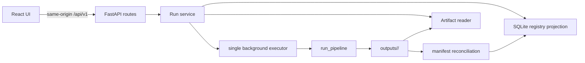

# MOMO Scholar Stage 4 Web MVP Scope and API/UI Contract Freeze

**Status:** implementation-ready contract freeze
**Date:** 2026-08-02
**Baseline:** `origin/master@e63b756`
**Product scope:** single-user, local-only Web demonstration over the existing
production survey pipeline

## 1. Purpose

Stage 4 adds a small Web surface to the existing CLI product. It does not replace
the production pipeline, its Pydantic models, or its filesystem artifacts. The Web
surface lets one local user:

1. create a research run;
2. see queued, running, degraded, failed, and completed states;
3. read the checked report and per-paper analyses;
4. resolve every displayed citation to persisted Evidence and paper provenance;
5. download the existing JSON and Markdown artifacts; and
6. open an explicitly synthetic, read-only result when offline.

This document freezes the Stage 4 scope and the V1 HTTP/UI contracts before Web
implementation begins. Where it projects an existing model, the current Python
model and persisted artifact remain authoritative.

## 2. Sources of truth and non-negotiable invariants

The implementation must preserve these current contracts:

- `paper_agent.pipeline.run_pipeline` remains the production system under test
  and the only production research execution path.
- `RunRecorder` creates a timestamped run directory before external pipeline
  work, writes `run_manifest.json` with `status="running"`, and atomically replaces
  it with the terminal manifest last.
- Artifact `run_id` is the run-directory name. Evidence IDs are scoped to that ID
  as `{artifact_run_id}:paper:{paper_id}:ev_NNN`.
- Terminal manifest states are exactly `completed`,
  `completed_with_degradation`, and `failed`. `running` is a persisted lifecycle
  value, not a successful outcome.
- `report.json` and `report.md` exist only after synthesis, citation validation,
  and publishability checks. A failed run must not be given a generated substitute
  report by the Web layer.
- `papers.json`, `documents.json`, `evidence.json`, `analyses.json`,
  `report.json`, `report.md`, `run_manifest.json`, and `logs.jsonl` retain their
  current meanings. When tracing is enabled, `traces.jsonl` remains a diagnostic
  artifact but is not a V1 public download.
- `report.json` is exactly one `CheckedSurveyReport`; the other plural JSON
  artifacts are arrays of their existing models.
- Retrieval remains isolated per paper. `auto` may degrade from vector to lexical
  only under the existing approved transient failures. Explicit `hybrid` failure
  remains terminal.
- PDF-backed public, text-native arXiv content is the default. Explicit abstract
  mode is intentional, not a degradation. OCR, uploads, and arbitrary websites
  remain unsupported.
- The Web implementation must not invoke evaluation, retrieval-benchmark, or
  citation-baseline commands. Evaluation artifacts and numeric claims are outside
  the Web MVP.

The SQLite registry is authoritative only for the API ID, accepted request, and
pre-manifest queue state; after execution starts, its lifecycle fields and all
frontend state are projections. A readable terminal `run_manifest.json` overrides
any stale registry status. Registry repair must move toward the manifest, never
rewrite the manifest to match the registry. SQLite never becomes authority for
research outputs.

## 3. Scope

### 3.1 In scope

- A FastAPI JSON API and a React/TypeScript single-page UI served locally.
- One in-process background executor with a bounded queue.
- A lightweight SQLite run registry for discovery and pre-manifest queue state.
- Same-origin production serving; a Vite development proxy may target FastAPI.
- Report, paper-analysis, and Evidence read models derived from current artifacts.
- Allowlisted artifact downloads.
- Poll-based progress; no WebSocket or server-sent-event dependency.
- A bundled, clearly labelled, read-only synthetic demo bundle that requires no
  provider, credentials, or network.
- Deterministic offline backend and frontend tests.

### 3.2 Out of scope

- Accounts, authentication, authorization roles, teams, tenancy, sharing, billing,
  quotas, or a public Internet deployment.
- Redis, Celery, distributed workers, multiple Web server processes, durable
  cancellation, resumable pipeline execution, or retrying a partial pipeline.
- Changing retrieval, citation checking, generation prompts, provider selection,
  report quality rules, or evaluation baselines.
- Uploads, OCR, non-arXiv sources, editing reports, annotating Evidence, or deleting
  runs through the API.
- Serving raw PDFs, arbitrary files, `.env`, logs, traces, database files, or
  provider request/response bodies.
- Inventing or displaying final evaluation metrics. Existing run counts, usage,
  timings, degradations, and errors may be displayed because they are manifest
  facts, not benchmark claims.

## 4. Architecture and ownership



The V1 implementation uses these boundaries:

| Boundary | Responsibility | Must not do |
|---|---|---|
| HTTP routes | Parse/validate requests, map service errors, return frozen schemas | Open arbitrary paths or call the provider directly |
| Run service | Coordinate registry, executor, artifact reader, and projections | Reimplement pipeline stages |
| Executor | Claim one queued run, build request-scoped settings, invoke `run_pipeline`, reconcile result | Run evaluation commands or hide terminal failures |
| Registry | Store API identity, request, queue/progress projection, and artifact directory basename | Store reports/Evidence as authority |
| Artifact reader | Safely resolve allowlisted files and validate current Pydantic contracts | Trust registry paths or deserialize unknown schemas |
| Frontend | Render API contracts, poll non-terminal runs, resolve citations | Infer success from HTTP reachability or elapsed time |

FastAPI and the executor run in one process with exactly one worker process in V1.
Starting Uvicorn with multiple workers is unsupported because each process would
own an independent in-memory executor.

## 5. Identity and lifecycle

### 5.1 Two identifiers

`POST /runs` must return before pipeline setup or provider access. The existing
artifact `run_id` does not exist until `RunRecorder.start`. V1 therefore freezes two
identifiers:

- `id`: opaque API run ID, a canonical lowercase UUID4 string generated at request
  acceptance. It is stable in every URL and is safe as a database key.
- `artifact_run_id`: nullable existing `RunManifest.run_id` and directory basename.
  It becomes visible after the pipeline creates its run directory.

The API never exposes an absolute artifact path. Evidence continues to contain
the artifact-scoped IDs produced by the pipeline; the frontend treats Evidence IDs
as opaque strings.

### 5.2 API statuses and phases

```text
queued -> running -> completed
                  -> completed_with_degradation
                  -> failed
queued -> interrupted
running -> interrupted   (only startup reconciliation when no terminal manifest exists)
```

`status` is one of:

- `queued`: accepted and not yet claimed by the only executor;
- `running`: pipeline execution has started and no terminal manifest exists;
- `completed`, `completed_with_degradation`, `failed`: exact manifest terminal
  values;
- `interrupted`: Web process stopped before a terminal manifest was available.

`interrupted` is a Web registry terminal state, not a `RunManifest` value. It must
not be written into the manifest. V1 has no resume or cancel endpoint. A user may
create a new run with the same request.

`phase` is a coarse progress projection:

```text
queued | initializing | search | acquisition | chunking | retrieval |
analysis | synthesis | citation_check | publishing | terminal
```

Phases are monotonic for UI purposes. Per-paper loops may revisit acquisition,
chunking, retrieval, and analysis internally; the projection never moves backward.
`progress.completed_units` and `progress.total_units` are nullable until paper
search returns. They describe the current per-paper phase only and are not an
overall percentage. The UI must not fabricate a percentage from elapsed time.

The first implementation must add an optional, typed progress sink at the
pipeline orchestration boundary. Its default is `None`, preserving CLI behavior.
The sink reports safe stage, operation, paper ID, and unit counts only; it cannot
receive prompts, model responses, credentials, or document text. Polling
`logs.jsonl` is not the progress contract.

### 5.3 Failure and degradation presentation

- `completed` means a publishable report with no recorded degradation.
- `completed_with_degradation` means a publishable report exists and the UI shows
  a persistent warning summary from `manifest.degradations`.
- `failed` means no report view. The UI shows safe `stage`/`code` values from
  `manifest.errors`, available counts, and retry-by-new-run guidance.
- `interrupted` means no claim about pipeline success. If startup reconciliation
  later finds a terminal manifest, the registry is repaired to that terminal state.
- Per-paper exclusion or analysis skip is shown only from manifest counts/issues;
  the UI does not infer a cause from missing array entries.
- Error responses and UI messages never include raw exception text. Codes are
  stable machine values; user text is maintained in a frontend code-to-message map.

## 6. Create-run contract

All API paths below are relative to `/api/v1`. JSON uses UTF-8. Unknown request
fields are rejected. Timestamps are UTC RFC 3339 strings. Content type is
`application/json` unless otherwise stated.

### 6.1 `POST /runs`

Request (`CreateRunRequest`):

```json
{
  "question": "How is hybrid retrieval used in scientific literature review?",
  "paper_limit": 3,
  "content_mode": "pdf_preferred",
  "retrieval": {
    "mode": "auto",
    "candidate_k": 30,
    "top_k": 8,
    "rrf_k": 60,
    "analysis_evidence_per_paper": 6
  }
}
```

Frozen validation:

- `question`: trimmed, 3..1000 Unicode code points; internal whitespace is
  preserved; blank-only input is rejected.
- `paper_limit`: integer 1..10. It maps to `run_pipeline(limit=...)` and later to
  `RunManifest.requested_limit`.
- `content_mode`: `pdf_preferred` or `abstract_only`; it maps to `no_pdf=False`
  or `True` respectively.
- `retrieval.mode`: exact `auto`, `lexical`, or `hybrid`.
- `candidate_k`: integer 1..100; `top_k`: integer 1..20 and no greater than
  `candidate_k`; `rrf_k`: integer 1..1000.
- `analysis_evidence_per_paper`: integer 1..20 and no greater than `top_k`.

All fields are required in the HTTP contract. The form may prefill current server
defaults, but it sends the chosen values explicitly so a queued request is
reproducible if environment defaults change before execution.

The executor loads normal safe server settings once per claimed run, then creates
a request-scoped immutable `Settings` copy overriding only `retrieval_mode`,
`retrieval_candidate_k`, `retrieval_top_k`, `retrieval_rrf_k`, and
`analysis_evidence_per_paper`. Provider models, endpoints, timeouts, PDF limits,
tracing, and secrets remain server configuration and are never request fields.

Response: `202 Accepted`, a `RunSummary` with `status="queued"`,
`phase="queued"`, and `artifact_run_id=null`. `Location` is
`/api/v1/runs/{id}`. V1 intentionally has no idempotency-key behavior; each valid
POST creates a distinct run.

Admission errors:

- `422 validation_error` for schema/range/cross-field failures;
- `503 queue_full` when queued plus running work has reached the configured
  capacity;
- `503 execution_unavailable` if the single executor failed to initialize.

Configuration/provider errors discovered after acceptance become a normal failed
run when a manifest exists. If failure happens before any artifact directory can
be created, the registry records `failed`, `artifact_run_id=null`, and one safe
registry error with `stage="initializing"`.

## 7. Read API contracts

### 7.1 Shared run models

`RunSummary`:

```json
{
  "id": "4f7b6a2e-7f5f-4d84-97a1-daf4f6375018",
  "artifact_run_id": "20260802-120000-000001-hybrid-retrieval",
  "origin": "live",
  "status": "running",
  "phase": "analysis",
  "question": "How is hybrid retrieval used in scientific literature review?",
  "paper_limit": 3,
  "content_mode": "pdf_preferred",
  "retrieval": {
    "mode": "auto",
    "candidate_k": 30,
    "top_k": 8,
    "rrf_k": 60,
    "analysis_evidence_per_paper": 6
  },
  "progress": {
    "completed_units": 1,
    "total_units": 3,
    "paper_id": "arxiv:1234.5678"
  },
  "created_at": "2026-08-02T04:00:00Z",
  "started_at": "2026-08-02T04:00:01Z",
  "finished_at": null,
  "has_report": false,
  "demo": false
}
```

`origin` is `live` or `bundled_demo`; `demo` is retained as an explicit rendering
guard and equals `origin == "bundled_demo"`. `progress.paper_id` is nullable.
`started_at` and `finished_at` are nullable according to lifecycle. `has_report`
is true only when both checked report artifacts exist for a successful terminal
manifest.

`RunDetail` extends `RunSummary` with nullable validated manifest projections:

```json
{
  "manifest": {
    "counts": {},
    "retrieval_outcomes": [],
    "degradations": [],
    "errors": [],
    "stage_elapsed_seconds": {},
    "usage": {},
    "settings": {},
    "component_versions": {}
  },
  "available_artifacts": ["papers.json", "run_manifest.json", "logs.jsonl"]
}
```

The fields inside `manifest` use the existing `RunCounts`, `RetrievalRecord`,
`RunIssue`, `UsageTotals`, `SafeRunSettings`, and scalar mappings without renaming.
Trace IDs/hashes and `execution_id` are omitted from the normal Web response.

### 7.2 `GET /runs`

Returns `{ "items": RunSummary[], "next_cursor": string | null }`, ordered by
`created_at` descending. V1 accepts only `limit` (default 20, range 1..100) and
`cursor` (opaque). This endpoint includes the bundled demo row and all local
registry rows; it does not recursively discover unrelated directories on every
request.

### 7.3 `GET /runs/{id}`

Returns `RunDetail`. This is the polling endpoint. While status is `queued` or
`running`, clients poll using the server-provided `Retry-After: 2`. Terminal
responses omit `Retry-After`. Reads reconcile a terminal manifest before forming
the response.

### 7.4 `GET /runs/{id}/report`

Available only for `completed` and `completed_with_degradation`. Response
(`ReportResponse`):

```json
{
  "run_id": "<API id>",
  "status": "completed_with_degradation",
  "report": {
    "question": "...",
    "tldr_claims": [],
    "method_taxonomy": [],
    "comparisons": [],
    "key_findings": [],
    "limitations": [],
    "open_questions": [],
    "rejected_critical_claims": []
  },
  "markdown": "# Formal Survey: ...\n",
  "degradations": []
}
```

`report` is the exact validated `CheckedSurveyReport` from `report.json`.
`markdown` is the exact UTF-8 content of `report.md`; the UI renders it with raw
HTML disabled. Evidence markers link through client-side resolution using exact
Evidence IDs. The API does not regenerate Markdown.

### 7.5 `GET /runs/{id}/papers`

Returns `{ "items": PaperSummary[] }` in `papers.json` order. Each item joins the
exact existing `Paper` with nullable matching `DocumentRecord`, `analysis_available`,
and `evidence_count`. Missing records in a degraded/failed run remain null rather
than being synthesized.

### 7.6 `GET /runs/{id}/papers/{paper_id}/analysis`

Returns:

```json
{
  "run_id": "<API id>",
  "paper": {},
  "document": {},
  "analysis": {
    "paper_id": "arxiv:1234.5678",
    "contributions": [],
    "methods": [],
    "experiments": [],
    "results": [],
    "limitations": []
  }
}
```

`paper`, `document`, and `analysis` validate as the existing `Paper`,
`DocumentRecord`, and `CheckedPaperAnalysis`. Findings keep exact `text`,
`evidence_ids`, and `support_status` fields. The route ID is URL-decoded once and
matched as an opaque exact paper ID; it is never treated as a path.

### 7.7 `GET /runs/{id}/evidence`

Returns `{ "items": EvidenceView[] }` in `evidence.json` order. Optional exact
`paper_id` narrows the result. V1 run limits make pagination unnecessary.

`EvidenceView` contains the exact existing Evidence fields plus a validated source
projection:

```json
{
  "evidence_id": "<artifact-scoped opaque ID>",
  "paper_id": "arxiv:1234.5678",
  "chunk_id": "arxiv:1234.5678:chunk:0001",
  "section": "Methods",
  "page": 4,
  "claim_type": "method",
  "quote": "...",
  "relevance_score": 0.91,
  "source": {
    "title": "Paper title",
    "url": "https://arxiv.org/abs/1234.5678",
    "pdf_url": "https://arxiv.org/pdf/1234.5678",
    "content_source": "pdf",
    "fallback_code": null
  }
}
```

`section` and `page` remain nullable and the UI says “Unknown section/page” when
null. It must not estimate page numbers. `quote` is the selected persisted chunk
text and is not fetched from the source URL.

### 7.8 `GET /runs/{id}/evidence/{evidence_id}`

Returns one `EvidenceView`, using an exact in-memory lookup after validating the
whole `evidence.json` array. Evidence IDs are not interpolated into filesystem or
SQL paths.

### 7.9 `GET /runs/{id}/artifacts/{name}`

The only accepted names are:

```text
papers.json documents.json evidence.json analyses.json report.json report.md
run_manifest.json logs.jsonl
```

The response uses `Content-Disposition: attachment` with the canonical allowlisted
filename, `X-Content-Type-Options: nosniff`, and `application/json`,
`application/x-ndjson`, or `text/markdown; charset=utf-8` as appropriate. A name
not exactly in the allowlist is `404 artifact_not_found`; no normalization,
subdirectory, alternate separator, percent-encoded traversal, symlink target, or
registry-supplied absolute path is accepted.

`traces.jsonl`, PDFs, SQLite, `.env`, temporary files, and unknown future artifacts
are private by default and require a later contract change to expose.

### 7.10 Shared errors

Every non-2xx JSON response is:

```json
{
  "error": {
    "code": "artifact_not_ready",
    "message": "The requested artifact is not available yet.",
    "details": {}
  }
}
```

Frozen mappings:

| HTTP | Code | Meaning |
|---:|---|---|
| 404 | `run_not_found` | API ID is unknown |
| 404 | `paper_not_found` / `evidence_not_found` | validated artifact has no exact ID |
| 404 | `artifact_not_found` | name is disallowed or allowed file is absent on a terminal run |
| 409 | `artifact_not_ready` | queued/running run has not published the requested view |
| 409 | `report_unavailable` | failed/interrupted run truthfully has no report |
| 409 | `artifact_corrupt` | file exists but fails UTF-8, JSON, or current Pydantic validation |
| 422 | `validation_error` | request contract failure |
| 429 | `run_busy` | reserved; not emitted in single-worker V1 |
| 503 | `queue_full` / `execution_unavailable` | admission/executor failure |
| 500 | `internal_error` | sanitized unexpected API error with request correlation ID |

No response includes a traceback, absolute path, environment value, SQL text, raw
provider body, or unsanitized exception.

## 8. SQLite registry and execution contract

### 8.1 Storage boundary

Defaults:

```text
outputs/
├── .web/
│   └── run-registry.sqlite3
└── <artifact_run_id>/
    └── existing pipeline artifacts
```

The state root, live artifact output root, and packaged read-only demo root are
server configuration resolved once at startup. The database stores only
`artifact_run_id` (a basename), never an absolute or user-provided path. For
`origin="live"`, the artifact reader resolves `output_root / artifact_run_id`; for
`origin="bundled_demo"`, it resolves `demo_root / artifact_run_id`. In both cases
it resolves symlinks and verifies the result is a direct child inside the selected
root before any read. The request cannot choose or override the root.

The registry uses SQLite WAL mode, foreign keys, a busy timeout, explicit
transactions, and schema migrations. V1 has one table:

```sql
CREATE TABLE runs (
  id TEXT PRIMARY KEY,
  artifact_run_id TEXT UNIQUE,
  origin TEXT NOT NULL CHECK (origin IN ('live', 'bundled_demo')),
  status TEXT NOT NULL CHECK (status IN (
    'queued', 'running', 'completed',
    'completed_with_degradation', 'failed', 'interrupted'
  )),
  phase TEXT NOT NULL CHECK (phase IN (
    'queued', 'initializing', 'search', 'acquisition', 'chunking',
    'retrieval', 'analysis', 'synthesis', 'citation_check',
    'publishing', 'terminal'
  )),
  request_json TEXT NOT NULL,
  progress_json TEXT NOT NULL,
  error_json TEXT,
  created_at TEXT NOT NULL,
  started_at TEXT,
  finished_at TEXT,
  updated_at TEXT NOT NULL
);
```

`request_json`, `progress_json`, and `error_json` are validated through frozen
Pydantic models on every read/write. SQLite is not used for report, paper,
analysis, Evidence, manifest, log, trace, or evaluation contents.

### 8.2 Queue and concurrency

- One executor thread owns production pipeline calls; maximum active runs is 1.
- Default queue capacity is 4 including the active run; it is configurable only at
  server startup.
- Admission count and insert occur in one transaction so concurrent POSTs cannot
  exceed capacity.
- Claiming the oldest queued row and changing it to `running/initializing` is one
  transaction.
- SQLite connections are not shared unsafely across threads. Each unit of work
  obtains its own short-lived connection from the registry abstraction.
- The API remains responsive while the synchronous pipeline runs in the executor.
- No second Web process may point at the same V1 registry. Startup acquires a local
  lock file and fails closed if another instance owns it.
- There is no cancellation. Browser navigation or disconnect never cancels a run.

### 8.3 Artifact discovery and reconciliation

Because the current pipeline returns `run_dir` only at completion/failure, the
executor needs a narrow callback from `RunRecorder.start` (or an equivalent
pipeline lifecycle sink) to persist `artifact_run_id` immediately after directory
creation. Directory polling and question-slug guessing are forbidden.

At startup:

1. seed or validate the one bundled-demo registry entry;
2. inspect registry rows in `queued` or `running`;
3. if a row has an artifact ID and a valid terminal manifest, reconcile it to that
   exact terminal state;
4. otherwise mark it `interrupted/terminal` with a safe registry error;
5. never automatically requeue or re-run it.

On normal completion or `PipelineRunFailed`, validate the manifest from disk and
copy only lifecycle projections into SQLite. If the returned exception code and
manifest differ, the manifest wins and a sanitized server diagnostic is logged.
If execution raises after artifact creation but no terminal manifest can be read,
the registry becomes `interrupted/terminal` with
`pipeline_terminated_without_manifest`; the Web layer must not invent a failed
manifest.

## 9. Frontend contract

### 9.1 Routes and pages

| Route | Required states and content |
|---|---|
| `/` | create-run form, server availability, recent runs, “Open offline demo” |
| `/runs/:id` | queued/running progress, terminal summary, warning/failure state, navigation to report/papers/downloads |
| `/runs/:id/report` | checked report sections, Evidence markers, degradation banner, Markdown/JSON downloads |
| `/runs/:id/papers/:paperId` | metadata/source, document mode/warnings, checked analysis categories, Evidence list |
| `/runs/:id/evidence/:evidenceId` | quote, paper/source link, exact section/page/chunk, retrieval score |

The router URL-encodes opaque IDs. It never constructs artifact filesystem URLs.

### 9.2 Form behavior

- Defaults are paper limit 3, `pdf_preferred`, retrieval `auto`, candidate 30,
  top 8, RRF 60, and six analysis Evidence items.
- Advanced retrieval values are visible in a collapsed “Retrieval settings” area.
- Submit is disabled only while the POST is pending, not for the lifetime of a run.
- A 202 response navigates immediately to `/runs/{id}`.
- Client validation improves feedback but server validation is authoritative.
- The UI never asks for or stores API keys. Missing provider configuration appears
  only as the resulting safe failed-run code.

### 9.3 Polling and connectivity

- Poll `GET /runs/{id}` every two seconds only for `queued` or `running`.
- Respect `Retry-After` when present; pause polling while the document is hidden;
  fetch immediately when it becomes visible again.
- Stop polling on every terminal status and on `404 run_not_found`.
- Network failures keep the last known state, show “Connection lost,” and retry
  with capped exponential backoff from 2 to 30 seconds plus jitter.
- A stale connection never changes a run to failed in client state.
- Page reload reconstructs all state from the API; in-memory timers are not
  authoritative.

### 9.4 Report, analysis, and Evidence rendering

- Critical and non-critical claim arrays preserve server order.
- Each Evidence ID is an exact link to the Evidence page. Unknown IDs are rendered
  as unresolved and never silently removed, although valid checked artifacts should
  prevent this state.
- `support_status` is always visible for non-critical report claims and all analysis
  findings. Rejected critical claims appear in a separate audit section, not in
  TL;DR or Key Findings.
- Quotes are rendered as text, never `innerHTML`. External paper URLs use
  `rel="noopener noreferrer"`.
- Markdown rendering disables raw HTML, scriptable links, and embedded remote
  images. JSON is rendered structurally or as escaped text.
- Missing page/section values are labelled unknown. Abstract fallback provenance
  and document warnings remain visible.

### 9.5 Bundled offline demo

The repository may contain exactly one small, deterministic artifact bundle built
from existing fake/offline pipeline dependencies. It must:

- validate against the same current artifact models and pass the same artifact
  reader as live results;
- perform no provider, retrieval-benchmark, citation-baseline, credential, or
  network access at startup or view time;
- be immutable through the API and use `origin="bundled_demo"`, `demo=true`;
- display a persistent “Synthetic offline demo — not research output or evaluation
  evidence” banner on every demo page and downloaded-demo link area;
- contain no headline evaluation metrics, real-provider claims, secrets, or
  implication that fixture outputs are production quality.

If the bundle is missing or invalid, the server logs a safe warning and omits the
demo row; it must not fabricate one in memory.

## 10. Security and operational requirements

- Bind to `127.0.0.1` by default. Binding to a non-loopback interface requires an
  explicit `--allow-network` startup flag and displays a warning; V1 still offers
  no authentication and is not approved for public exposure.
- Enforce same-origin requests in production. Development CORS, if enabled, is an
  exact configured origin list, never `*`.
- Accept JSON request bodies only, with a small fixed body limit (16 KiB).
- Do not accept output paths, filenames, URLs, provider settings, headers, prompt
  text, or credentials from run-create requests.
- Resolve configured roots once and reject symlink/path escapes. Downloads use an
  exact filename allowlist and canonical server filenames.
- Load secrets only through existing `load_settings`; never return, persist in the
  registry, place in frontend environment variables, or log them. Preserve current
  `SafeRunSettings`, trace sanitization, and provider exception sanitization.
- Add `Cache-Control: no-store` to API JSON and downloads because research content
  may be sensitive even in a local demo.
- Add `Content-Security-Policy` for the built UI with no inline script, no object,
  and same-origin connect; disallow framing.
- Treat artifacts as untrusted local data: bounded reads, UTF-8 validation, strict
  Pydantic validation, escaped rendering, and no template execution.
- Server logs use API ID and a random request correlation ID, not question text,
  Evidence quotes, raw exceptions, secrets, or absolute artifact paths.
- Database corruption or migration failure makes run creation unavailable; it does
  not cause recursive import of arbitrary output directories.

## 11. Testing and verification contract

Ordinary Stage 4 tests are deterministic and offline. They use fake pipeline
dependencies and temporary directories; they never read `.env`, credentials, real
`outputs/`, or provider endpoints.

### 11.1 Backend contract tests

- strict create-request validation, unknown fields, boundary values, and all
  cross-field constraints;
- exact request-to-`run_pipeline`/request-scoped-`Settings` mapping;
- 202/Location behavior, queue capacity, atomic claim, and one-active-run rule;
- every lifecycle transition, phase monotonicity, per-paper unit progress, and
  startup interruption reconciliation;
- manifest-authority repair when registry and terminal manifest disagree;
- current model validation for every JSON artifact and corrupt/truncated artifact
  errors;
- report absence on failure and report availability for both successful statuses;
- paper/analysis/Evidence joins, nullable source fields, exact opaque-ID lookup;
- artifact content types/disposition plus traversal, encoding, separator, symlink,
  unknown-name, PDF, trace, database, and `.env` denial;
- secret canary absent from API responses, SQLite, downloaded allowlisted artifacts,
  and captured server logs;
- bundled demo validation and proof that opening it makes zero pipeline/provider
  calls;
- API responsiveness while a blocking fake pipeline owns the executor.

### 11.2 Frontend tests

- form defaults, advanced settings, server error mapping, and navigation after 202;
- queued/running polling, Retry-After, hidden-tab pause, terminal stop, reconnect
  backoff, and no client-side false failure;
- completed, degraded, failed, interrupted, corrupt-artifact, and not-found pages;
- report ordering, support labels, rejected-claim audit, Evidence deep links, unknown
  page/section labels, and abstract fallback warning;
- escaped quote/Markdown content, blocked raw HTML/scriptable links, safe external
  links, and opaque ID encoding;
- persistent offline-demo warning and no display of fabricated metrics.

### 11.3 Integration and manual smoke

One offline vertical integration starts the Web app with a fake executor, submits a
run, observes progress, completes all eight successful-run artifacts, reads report,
paper analysis, and Evidence, and downloads every allowlisted artifact. A separate
restart test interrupts a blocking run and verifies reconciliation.

A real-provider smoke is manual and separately invoked only after implementation.
It is not part of normal CI, does not run retrieval/citation baselines, and does not
authorize numeric quality claims. Stage 4 contract work itself requires no live
smoke.

## 12. Parallel implementation boundaries

Backend and frontend may proceed in parallel only after the shared schema names,
enums, endpoints, examples, and error codes in this document are captured in an
OpenAPI snapshot.

### 12.1 Backend-owned files

```text
paper_agent/web/
├── app.py                 # FastAPI construction, middleware, static mount
├── api_models.py          # frozen HTTP Pydantic contracts
├── errors.py              # stable service/API error mapping
├── registry.py            # SQLite schema, migrations, transactions
├── artifacts.py           # safe resolution, validation, read projections
├── execution.py           # bounded single executor and reconciliation
├── service.py             # use-case orchestration
└── routes/
    └── runs.py            # /api/v1/runs endpoints
tests/web/                 # backend unit/contract/integration tests
```

Backend also owns the smallest necessary additions to `paper_agent.pipeline` and
`RunRecorder.start` for typed progress and artifact-run-created callbacks. Those
callbacks must default to no-op/None and be covered by existing pipeline tests so
CLI behavior and artifacts remain unchanged.

### 12.2 Frontend-owned files

```text
web/
├── package.json
├── vite.config.ts
└── src/
    ├── api/contracts.ts   # generated or mechanically checked from OpenAPI
    ├── api/client.ts
    ├── routes/
    ├── components/
    ├── polling/
    └── test/
```

Frontend must not import Python files, inspect `outputs/`, or duplicate pipeline
business rules. It owns presentation text for stable error codes, status/phase UI,
safe Markdown rendering, and interaction tests.

### 12.3 Shared/generated boundary

```text
openapi/web-v1.json        # checked-in API snapshot; backend generation authority
web/src/api/contracts.ts   # generated/checkable frontend projection
```

Neither side edits the other's generated contract manually. CI fails when the
running backend OpenAPI differs from the snapshot or generated TypeScript differs
from its projection.

## 13. First small implementation tasks

Tasks deliberately stop before broad Web feature work:

1. **Contract models and OpenAPI snapshot:** add strict HTTP Pydantic models,
   error codes, empty route signatures, and snapshot tests; no pipeline call.
2. **Read-only artifact reader:** implement allowlisted safe resolution and current
   model validation against temporary/offline artifacts; no SQLite or provider.
3. **Registry lifecycle:** add migration, repository interface, queue admission,
   atomic claim, and reconciliation tests with temporary SQLite.
4. **Pipeline lifecycle seam:** add optional typed progress/artifact-run callbacks
   with focused offline pipeline tests and CLI regression checks.
5. **Executor/service vertical slice:** connect POST/status polling to a blocking
   fake pipeline, enforcing single concurrency and restart interruption semantics.
6. **Frontend shell from OpenAPI:** implement routes, typed client, create form, and
   all static state fixtures against a mock API.
7. **Read views and downloads:** backend report/paper/Evidence projections and
   frontend checked-content rendering, developed on separate owned files.
8. **Bundled demo and offline vertical test:** generate/validate the immutable fake
   bundle and prove zero provider/network calls.
9. **Production assembly:** same-origin static serving, security headers, startup
   configuration, README run instructions, full offline verification, then a
   separately authorized manual smoke if credentials and network are available.

Tasks 2, 3, and 6 may run in parallel after Task 1. Task 4 can run in parallel with
them because it owns only pipeline lifecycle seams and tests. Task 5 depends on 3
and 4; Task 7 depends on 1 and 2; Task 8 depends on 2, 5, and 7; Task 9 is last.

## 14. Acceptance criteria

Stage 4 Web MVP is complete only when:

- a valid POST returns an API run ID immediately and a single background executor
  runs the unchanged production pipeline contract;
- the UI truthfully represents queued, monotonic progress, both successful states,
  failed, interrupted, and connectivity loss;
- a terminal manifest is authoritative over SQLite and no failed/interrupted run is
  shown as having a report;
- report claims and per-paper findings preserve support status and every Evidence
  link resolves to exact persisted quote, paper, chunk, section, and page when known;
- all eight artifacts of a successful run can be downloaded by exact allowlisted
  name, while
  path traversal, PDFs, traces, SQLite, secrets, and arbitrary files are denied;
- one-process/one-active-run concurrency, bounded admission, and restart behavior
  are deterministic and tested;
- the offline demo uses only validated synthetic artifacts, is unmistakably
  labelled, and makes no network/provider/baseline call;
- ordinary backend and frontend suites are offline, deterministic, and pass;
- CLI behavior and current artifact schemas remain regression-tested;
- no baseline is run and no final quality metric is invented or implied by the Web
  demonstration.
